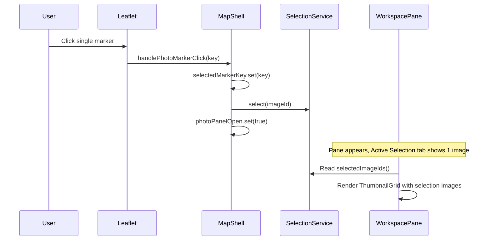
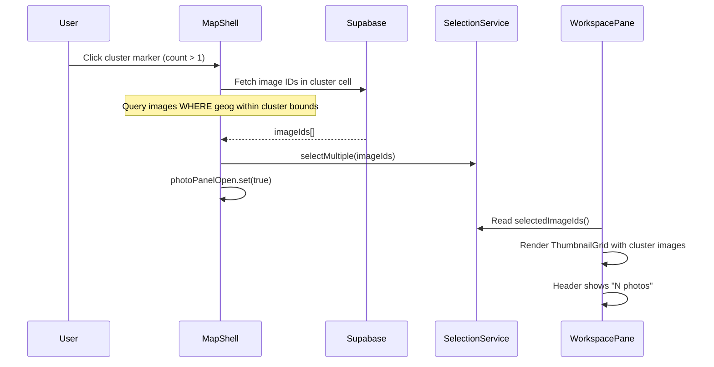
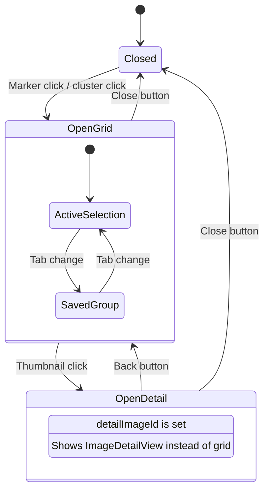

# Workspace Pane — Implementation Blueprint

> **Spec**: [element-specs/workspace-pane.md](../element-specs/workspace-pane.md)
> **Status**: Not implemented as a standalone component. Currently ImageDetailView is rendered directly inside MapShellComponent. DragDivider exists.

## Existing Infrastructure

| File                                                                 | What it provides                                                              |
| -------------------------------------------------------------------- | ----------------------------------------------------------------------------- |
| `features/map/workspace-pane/drag-divider/drag-divider.component.ts` | Resize handle (already works)                                                 |
| `features/map/workspace-pane/image-detail-view.component.ts`         | Detail view (already exists)                                                  |
| `features/map/map-shell/map-shell.component.ts`                      | Parent — owns `photoPanelOpen`, `workspacePaneWidth`, `detailImageId` signals |

## Missing Infrastructure (must be created)

### SelectionService

```typescript
// File: core/selection.service.ts
import { Injectable, computed, signal } from "@angular/core";

@Injectable({ providedIn: "root" })
export class SelectionService {
  /** Image IDs in the current Active Selection */
  readonly selectedImageIds = signal<string[]>([]);
  readonly selectionCount = computed(() => this.selectedImageIds().length);
  readonly hasSelection = computed(() => this.selectedImageIds().length > 0);

  /** Set selection to a single image (marker click) */
  select(imageId: string): void {
    this.selectedImageIds.set([imageId]);
  }

  /** Toggle an image in/out of selection (Ctrl+click) */
  toggle(imageId: string): void {
    this.selectedImageIds.update((ids) => {
      const index = ids.indexOf(imageId);
      if (index >= 0) {
        return ids.filter((_, i) => i !== index);
      }
      return [...ids, imageId];
    });
  }

  /** Replace selection with multiple images (cluster click) */
  selectMultiple(imageIds: string[]): void {
    this.selectedImageIds.set(imageIds);
  }

  /** Clear all selection */
  clear(): void {
    this.selectedImageIds.set([]);
  }

  /** Reads the selectedImageIds signal — call inside a template or computed() for reactivity. */
  isSelected(imageId: string): boolean {
    return this.selectedImageIds().includes(imageId);
  }
}
```

### WorkspacePaneComponent

```typescript
// File: features/map/workspace-pane/workspace-pane.component.ts
@Component({
  selector: "ss-workspace-pane",
  standalone: true,
  imports: [
    GroupTabBarComponent,
    ThumbnailGridComponent,
    ImageDetailViewComponent,
    SortingControlsComponent,
  ],
  templateUrl: "./workspace-pane.component.html",
  styleUrl: "./workspace-pane.component.scss",
})
export class WorkspacePaneComponent {
  // ── Inputs from MapShell ──
  width = input<number>(320);
  detailImageId = input<string | null>(null);

  // ── Outputs to MapShell ──
  closed = output<void>();
  detailRequested = output<string>(); // imageId → open detail
  editLocationRequested = output<string>(); // imageId → correction mode

  // ── Internal state ──
  activeTabId = signal<string>("selection"); // 'selection' | group UUID
  mobileSnapPoint = signal<"minimized" | "half" | "full">("half");

  // ── Injected ──
  selectionService = inject(SelectionService);

  // ── Methods ──
  close(): void {
    this.closed.emit();
  }
  onTabChange(tabId: string): void {
    this.activeTabId.set(tabId);
  }
  onThumbnailClick(imageId: string): void {
    this.detailRequested.emit(imageId);
  }
}
```

## Data Flow

### Marker Click → Workspace Pane



### Cluster Click → Workspace Pane



### Workspace State Machine



### Mobile Bottom Sheet Snap Points

```mermaid
stateDiagram-v2
    [*] --> Half

    Minimized --> Half: Swipe up
    Minimized --> Closed: Swipe down
    Half --> Full: Swipe up
    Half --> Minimized: Swipe down
    Full --> Half: Swipe down

    state Minimized {
        note: 64px - drag handle + group name only
    }
    state Half {
        note: 50vh - shows thumbnails
    }
    state Full {
        note: 100vh - full content
    }
```

## Database Layer

### Fetch cluster image IDs (for cluster click)

```typescript
// When user clicks a cluster, fetch all image IDs within that cluster cell
// The cluster cell is defined by ST_SnapToGrid at the current zoom level
const { data } = await this.supabaseService.client
  .from("images")
  .select("id")
  .gte("latitude", cellSouth)
  .lte("latitude", cellNorth)
  .gte("longitude", cellWest)
  .lte("longitude", cellEast)
  .order("captured_at", { ascending: false });

const imageIds = data?.map((row) => row.id) ?? [];
```

### Fetch thumbnails for selection images

```typescript
// Batch sign thumbnail URLs for the Active Selection
const { data } = await this.supabaseService.client
  .from("images")
  .select("id, thumbnail_path, storage_path, captured_at, address_label")
  .in("id", imageIds)
  .order("captured_at", { ascending: false });

// Sign URLs in batch
for (const image of data ?? []) {
  const path = image.thumbnail_path ?? image.storage_path;
  const { data: signed } = await this.supabaseService.client.storage
    .from("images")
    .createSignedUrl(path, 3600); // 1 hour TTL
  // Store signed.signedUrl with the image
}
```

## Wiring to MapShellComponent

### Template Changes

```html
<!-- map-shell.component.html — updated structure -->
<div class="map-shell">
  <!-- future: <ss-sidebar /> -->

  <div class="map-zone">
    <div
      #mapContainer
      class="map-container"
      [class.map-container--placing]="placementActive() || searchPlacementActive()"
    ></div>
    <ss-search-bar (mapCenterRequested)="onSearchMapCenterRequested($event)" />
    <ss-active-filter-chips />
    <ss-gps-button (locate)="onGpsLocate()" />
  </div>

  @if (photoPanelOpen()) {
  <ss-drag-divider
    [containerWidth]="workspacePaneWidth()"
    (widthChange)="onWorkspaceWidthChange($event)"
  />

  <ss-workspace-pane
    [style.width.px]="workspacePaneWidth()"
    [detailImageId]="detailImageId()"
    (closed)="photoPanelOpen.set(false)"
    (detailRequested)="openDetailView($event)"
    (editLocationRequested)="onEditLocationRequested($event)"
  />
  } @if (uploadPanelOpen()) {
  <app-upload-panel ... />
  }
</div>
```

## Mobile Bottom Sheet Implementation

Use CSS transforms and touch events — no external library required.

```typescript
// Bottom sheet snap logic (in workspace-pane.component.ts)
private readonly snapPoints = { minimized: 64, half: '50vh', full: '100vh' };

onDragHandlePointerDown(event: PointerEvent): void { /* track start Y */ }
onDragHandlePointerMove(event: PointerEvent): void { /* translate sheet */ }
onDragHandlePointerUp(event: PointerEvent): void {
  // Calculate velocity and distance to snap to nearest point
  const velocity = deltaY / deltaTime;
  if (velocity > threshold) this.snapDown();
  else if (velocity < -threshold) this.snapUp();
  else this.snapToNearest(currentHeight);
}
```
