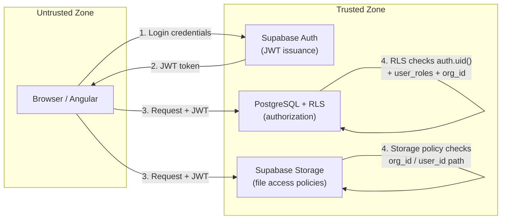
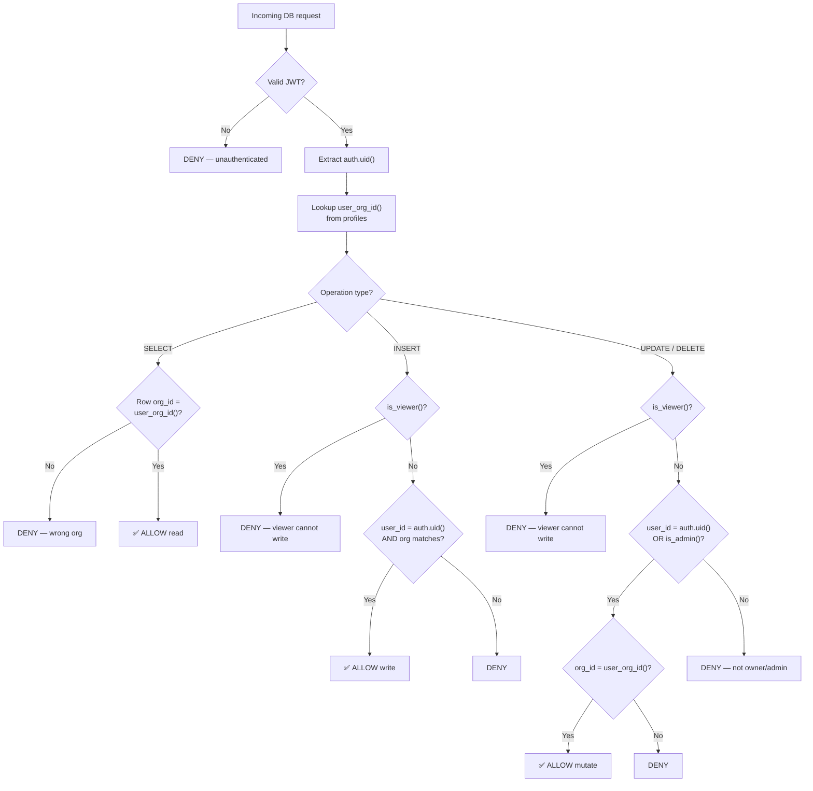
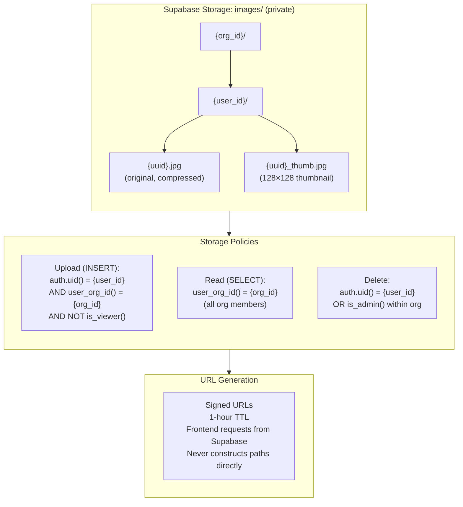
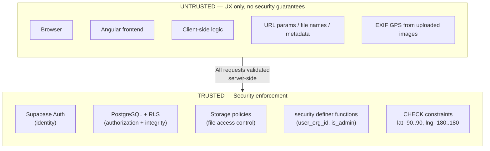

# Security Boundaries Documentation

**Who this is for:** engineers and operators responsible for keeping Sitesnap data secure.  
**What you'll get:** the trust model, RLS boundaries, and storage rules that must never be violated.

See also: `database-schema.md`, `user-lifecycle.md`, `architecture.md`.

---

## 1. Authentication Boundary



- All access requires a valid Supabase JWT.
- Supabase verifies the token before any database access.
- The frontend is never trusted for identity validation.
- Registration creates a `profiles` row via trigger; the row must include a valid `organization_id` (see D12).

**Invariant**

- Only authenticated requests (with valid JWT) can reach RLS-protected tables.
- Every authenticated user belongs to exactly one organization.

---

## 2. Authorization Boundary

### RLS Decision Tree



- Authorization is enforced via Row-Level Security (RLS) in PostgreSQL.
- The frontend does **not** decide permissions; it only displays what the database allows.
- RLS policies use:
  - `auth.uid()` for the current user.
  - `user_roles` and `roles` tables for role checks.
  - `profiles.organization_id` for organization-scoped visibility.

### 2.1 Organization-Scoped Visibility (D12)

All data is scoped to the user's organization. A user can never read or write data belonging to another organization. The canonical org-membership check used across policies:

```sql
-- reusable helper
create or replace function public.user_org_id()
returns uuid
language sql stable security definer
as $$
  select organization_id from public.profiles where id = auth.uid();
$$;
```

### 2.2 Roles

| Role           | Capabilities                                                                      |
| -------------- | --------------------------------------------------------------------------------- |
| **admin**      | Full CRUD on all org data; manage users and roles; delete org resources.          |
| **technician** | Upload images; edit own images (metadata, coordinates); create/manage own groups. |
| **viewer**     | Read-only access to all org images, projects, and groups. No uploads, no edits.   |

The `viewer` role enables the Clerk persona (UC2) to browse and quote without risking data modification.

**Invariant**

- Any new table containing user- or project-scoped data must ship with RLS policies before it is used.
- Every RLS SELECT policy must include an organization-scope check.

---

## 3. Row-Level Security Policies

All policies below assume the `user_org_id()` helper from §2.1.

### 3.1 Images Table

| Operation  | Policy                                                                                                                             |
| ---------- | ---------------------------------------------------------------------------------------------------------------------------------- |
| **SELECT** | `organization_id = user_org_id()` — all org members (including viewer) can read.                                                   |
| **INSERT** | `user_id = auth.uid() AND organization_id = user_org_id()` — user owns the row; org must match. Viewers are blocked by role check. |
| **UPDATE** | `(user_id = auth.uid() OR is_admin()) AND organization_id = user_org_id()` — owner or admin within the same org.                   |
| **DELETE** | Same as UPDATE.                                                                                                                    |

Note: `images.organization_id` is denormalized from `profiles.organization_id` for RLS performance (avoids join on every SELECT). A trigger keeps them in sync.

### 3.2 Profiles Table

- **SELECT**: Own profile (`id = auth.uid()`), or admin can read profiles within the same org.
- **UPDATE**: Own profile only (`id = auth.uid()`). Admins cannot edit other users' profiles.
- **INSERT / DELETE**: Trigger/system-managed, not client-managed.
- `organization_id` is immutable after creation (enforced by trigger or policy).

### 3.3 Organizations Table

- **SELECT**: User can read their own organization (`id = user_org_id()`).
- **INSERT / UPDATE / DELETE**: Restricted to super-admin or service role. No client-side org management in MVP.

### 3.4 Roles and User Roles

- `roles`: readable by authenticated users; write access restricted to admins.
- `user_roles`:
  - Self-read allowed for UX (`user_id = auth.uid()`).
  - Role assignment/revocation restricted to admins within the same org.
  - Prevent self-demotion if it would remove the last admin account.
  - Prevent removing the final role for any user.

### 3.5 Projects and Metadata

- `projects`: SELECT by org members (`organization_id = user_org_id()`). INSERT/UPDATE/DELETE by owner or admin.
- `metadata_keys`: scoped to `organization_id`. Readable by all org members. Writable by creator or admin.
- `image_metadata`: inherits visibility/write permissions from the parent image.

### 3.6 Saved Groups

- `saved_groups`:
  - **SELECT**: `user_id = auth.uid()` — groups are private to the creator. (Future: shared groups via org visibility.)
  - **INSERT**: `user_id = auth.uid()`.
  - **UPDATE / DELETE**: `user_id = auth.uid()`.
- `saved_group_images`:
  - Inherits access from the parent `saved_groups` row via `group_id`.
  - INSERT/DELETE allowed only if user owns the group.

### 3.7 Coordinate Corrections

- `coordinate_corrections`:
  - **INSERT**: Any org member can log a correction for an image within the org.
  - **SELECT**: Readable by the image owner and admins (audit trail).
  - **UPDATE / DELETE**: Not allowed (append-only audit log).

### Role Check Logic (Conceptual)

```sql
-- Admin check scoped to the user's own org
create or replace function public.is_admin()
returns boolean
language sql stable security definer
as $$
  select exists (
    select 1
    from user_roles ur
    join roles r on r.id = ur.role_id
    where ur.user_id = auth.uid()
      and r.name = 'admin'
  );
$$;

-- Viewer check (read-only role)
create or replace function public.is_viewer()
returns boolean
language sql stable security definer
as $$
  select exists (
    select 1
    from user_roles ur
    join roles r on r.id = ur.role_id
    where ur.user_id = auth.uid()
      and r.name = 'viewer'
  );
$$;
```

Viewers are blocked from INSERT/UPDATE/DELETE on `images`, `projects`, and `metadata_keys` by adding `AND NOT is_viewer()` to write policies.

---

## 4. Storage Security

### Storage Path & Policy Diagram



- Images are stored in Supabase Storage in a private bucket named `images`.

### 4.1 Bucket Structure

```
images/
  {org_id}/
    {user_id}/
      {uuid}.jpg          ← original (compressed)
      {uuid}_thumb.jpg     ← 128×128 thumbnail
```

Path segments use UUIDs only — no user-visible names, no sequential IDs.

### 4.2 Storage Policies

| Operation           | Rule                                                                                                              |
| ------------------- | ----------------------------------------------------------------------------------------------------------------- |
| **Upload (INSERT)** | `auth.uid()` matches the `{user_id}` segment AND `user_org_id()` matches the `{org_id}` segment. Viewers blocked. |
| **Read (SELECT)**   | `user_org_id()` matches the `{org_id}` segment — all org members can read.                                        |
| **Delete**          | Object owner (`{user_id}` matches `auth.uid()`) or admin within the same org.                                     |

### 4.3 Signed URLs

- MVP defaults to **signed URLs** with a 1-hour TTL.
- The frontend requests a signed URL from Supabase; it never constructs storage paths itself.
- Thumbnails use the same signed-URL mechanism — no public bucket.

### 4.4 Upload Constraints

- Maximum file size: **25 MB** (enforced by Supabase Storage config).
- Allowed MIME types: `image/jpeg`, `image/png`, `image/heic`, `image/heif`, `image/webp`.
- HEIC/HEIF files are converted to JPEG client-side before upload (see architecture.md §5).

### 4.5 CORS Configuration

Supabase Storage CORS must allow:

- Origin: the deployed frontend domain(s) and `localhost:4200` for development.
- Methods: `GET`, `POST`, `PUT`, `DELETE`, `OPTIONS`.
- Headers: `Authorization`, `Content-Type`, `x-upsert`.
- Expose: `Content-Length`, `Content-Type`.

---

## 5. Trust Model

### Trust Boundary Diagram



**Trusted:**

- Supabase Auth (for identity).
- PostgreSQL with RLS (for authorization and data integrity).
- Supabase Storage policies (for file access control).
- Server-side functions marked `security definer` (for helper logic like `user_org_id()`).

**Untrusted:**

- Browser.
- Angular frontend.
- Any client-side logic.
- URL parameters, file names, or metadata sent by the client.

**Implication**

- Client-side checks are for UX only.  
  Security and access control must always be implemented and tested at the database/policy level.
- EXIF GPS coordinates from uploaded images are treated as untrusted input; latitude must be in `[-90, 90]`, longitude in `[-180, 180]` (enforced by CHECK constraints — see database-schema.md).

---

## 6. Security Checklist for New Features

Before any new table or feature ships:

1. RLS policies exist for SELECT, INSERT, UPDATE, DELETE.
2. Every SELECT policy includes an `organization_id` scope check.
3. Write policies block the `viewer` role where appropriate.
4. Storage policies match the bucket path convention `{org_id}/{user_id}/{uuid}`.
5. No sensitive data is exposed in error messages returned to the client.
6. Signed URLs are used for all storage access (no public URLs).
7. Foreign keys with CASCADE or SET NULL are documented in the cascade summary (database-schema.md §12).
