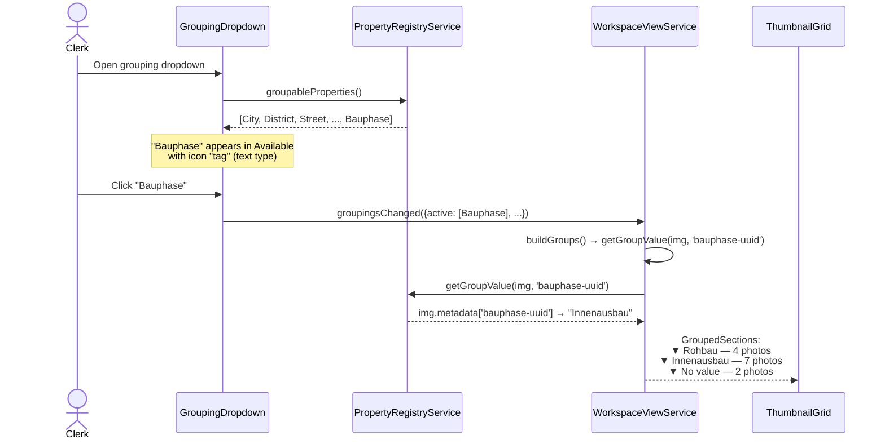
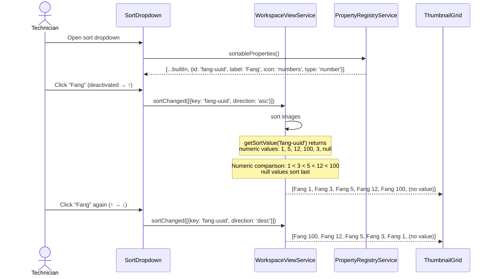
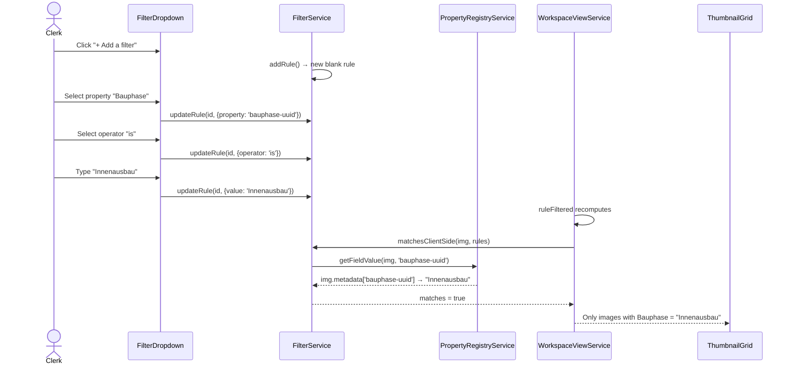
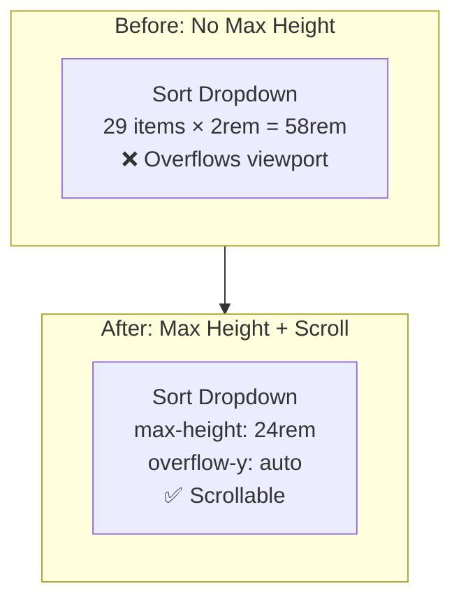
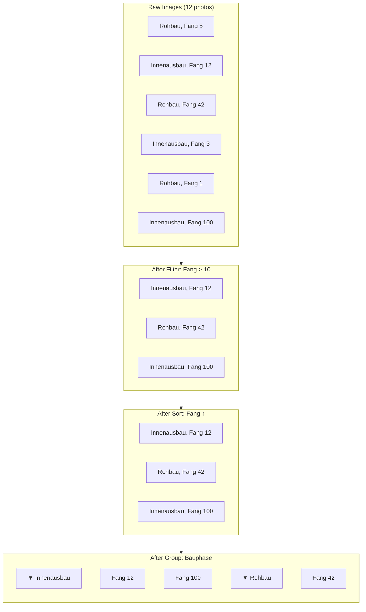
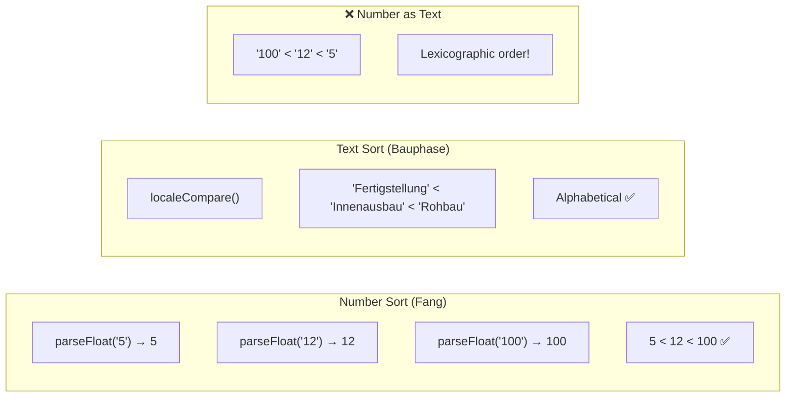

# Custom Properties in Operators — Use Cases

> **Related specs:** [custom-properties](../element-specs/custom-properties.md), [property-registry](../element-specs/property-registry.md), [sort-dropdown](../element-specs/sort-dropdown.md), [grouping-dropdown](../element-specs/grouping-dropdown.md), [filter-dropdown](../element-specs/filter-dropdown.md)
> **Related use cases:** [property-registry PR-1–PR-5](property-registry.md), [workspace-view WV-3, WV-4, WV-6](workspace-view.md)

---

## Overview

Custom properties (user-defined metadata keys like "Floor", "Bauphase", "Fang") must be usable in all workspace operators: **Sort**, **Grouping**, and **Filter**. This means:

1. Custom properties appear alongside built-in properties in every operator dropdown
2. Number-type custom properties sort **numerically** (not lexicographically): 5, 12, 100 — not 100, 12, 5
3. Dropdown containers have a **max-height with scrolling** to prevent overflow when many properties exist
4. Filter operators adapt to the property type (text vs number vs date)

### Scenario Index

| ID    | Scenario                                         | Persona    |
| ----- | ------------------------------------------------ | ---------- |
| CPO-1 | Group by a custom text property                  | Clerk      |
| CPO-2 | Sort by a custom number property (numeric order) | Technician |
| CPO-3 | Filter by a custom property value                | Clerk      |
| CPO-4 | Dropdown scrolling with many custom properties   | Admin      |
| CPO-5 | Combined: group + sort + filter on custom props  | Technician |
| CPO-6 | Numeric sort vs text sort behavior               | Clerk      |

---

## CPO-1: Group by a Custom Text Property

**Product context:** A construction company tracks "Bauphase" (construction phase) per image, e.g. "Rohbau", "Innenausbau", "Fertigstellung". The clerk wants to group site photos by phase.

### Preconditions

- Admin has created a custom property "Bauphase" (type: text)
- Several images have been tagged with Bauphase values

### Steps

1. User clicks the **Grouping** toolbar button
2. Dropdown opens showing built-in properties + "Bauphase" in the Available section
3. User clicks "Bauphase" to move it to the Active section
4. Workspace re-groups images by Bauphase value
5. Group headings appear: "Rohbau (4)", "Innenausbau (7)", "Fertigstellung (2)"
6. Images without a Bauphase value appear under "No value"



### Expected state after

- Grouping dropdown shows custom properties alongside built-in ones
- Group headings display the custom property value
- Images without values grouped under "No value"

---

## CPO-2: Sort by a Custom Number Property (Numeric Order)

**Product context:** A chimney inspector tags photos with "Fang" (chimney number). When sorting by Fang, numbers must sort numerically: 1, 2, 5, 12, 100 — **not** lexicographically: 1, 100, 12, 2, 5.

### Preconditions

- Admin has created a custom property "Fang" (type: number)
- Images have Fang values: "1", "5", "12", "100", "3"

### Steps

1. User clicks the **Sort** toolbar button
2. Dropdown shows built-in properties + "Fang" with `#` icon
3. User clicks "Fang" → direction toggles to ascending (↑)
4. Images sort numerically: 1, 3, 5, 12, 100
5. User clicks again → direction flips to descending (↓)
6. Images sort: 100, 12, 5, 3, 1
7. Images without a Fang value always sort **last**



### Key behavior: Numeric sort

```
Text sort (wrong):    "1", "100", "12", "2", "5"    ← lexicographic
Numeric sort (right): 1, 2, 5, 12, 100               ← numeric comparison
```

The `PropertyRegistryService.getSortValue()` method parses number-type custom property values via `parseFloat()`. If the value is not a valid number, it is treated as `null` and sorts last.

---

## CPO-3: Filter by a Custom Property Value

**Product context:** The clerk wants to see only photos tagged with Bauphase "Innenausbau".

### Preconditions

- Custom property "Bauphase" exists (type: text)
- Images have various Bauphase values

### Steps

1. User clicks the **Filter** toolbar button
2. Clicks "+ Add a filter"
3. In the Property dropdown, selects "Bauphase" (appears alongside built-in properties)
4. In the Operator dropdown, selects "is"
5. Types "Innenausbau" in the Value input
6. Filter applies immediately — only Innenausbau photos remain



### Number property filtering

When filtering a number-type property like "Fang":

- Operators include: `=`, `≠`, `>`, `<`, `≥`, `≤` (in addition to text operators)
- Comparison is numeric, not string-based

---

## CPO-4: Dropdown Scrolling with Many Custom Properties

**Product context:** An organization has 15+ custom properties. Without a size limit, the dropdown would extend beyond the viewport.

### Preconditions

- 14 built-in properties + 15 custom properties = 29 total properties

### Expected behavior

1. Sort dropdown: items area has `max-height: 24rem` with `overflow-y: auto`
2. Grouping dropdown: both Active and Available sections scroll within a `max-height: 24rem` container
3. Filter dropdown: property `<select>` shows native browser dropdown (already handles long lists); filter rules area scrolls at `max-height: 20rem`
4. All dropdowns: smooth scrollbar, no visual jump when content transitions from non-scrolling to scrolling



---

## CPO-5: Combined — Group + Sort + Filter on Custom Properties

**Product context:** The technician groups photos by "Bauphase", sorts by "Fang" (chimney number), and filters for Fang > 10.

### Steps

1. **Group** by Bauphase → sections: "Rohbau", "Innenausbau"
2. **Sort** by Fang ascending → within each group, photos ordered 1, 3, 12, 42
3. **Filter** Fang > 10 → only Fang 12 and 42 remain, still grouped by Bauphase



---

## CPO-6: Numeric Sort vs Text Sort Behavior

**Product context:** Demonstrates the difference between sorting number-type and text-type custom properties.

### Number-type property: "Fang"

| Value stored | Sort value used | Ascending order |
| ------------ | --------------- | --------------- |
| "5"          | 5               | 1st             |
| "12"         | 12              | 2nd             |
| "100"        | 100             | 3rd             |
| "" (empty)   | null            | Last            |

### Text-type property: "Bauphase"

| Value stored     | Sort value used  | Ascending order |
| ---------------- | ---------------- | --------------- |
| "Fertigstellung" | "fertigstellung" | 1st             |
| "Innenausbau"    | "innenausbau"    | 2nd             |
| "Rohbau"         | "rohbau"         | 3rd             |
| "" (empty)       | null             | Last            |



### Implementation detail

The `PropertyRegistryService.getSortValue()` method checks the property type:

- **number**: `parseFloat(value)` — returns `NaN` → treated as `null` (sorts last)
- **text/select/checkbox**: returns raw string value
- **date**: returns ISO date string (natural sort order for ISO dates)
