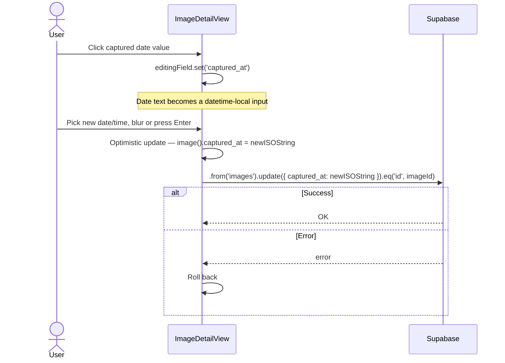
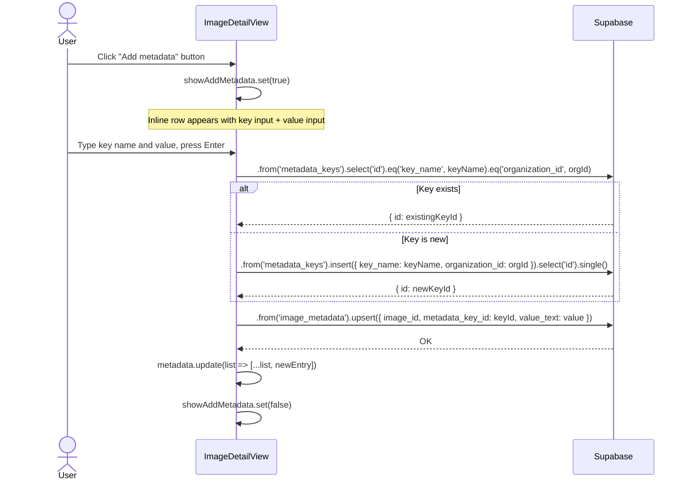
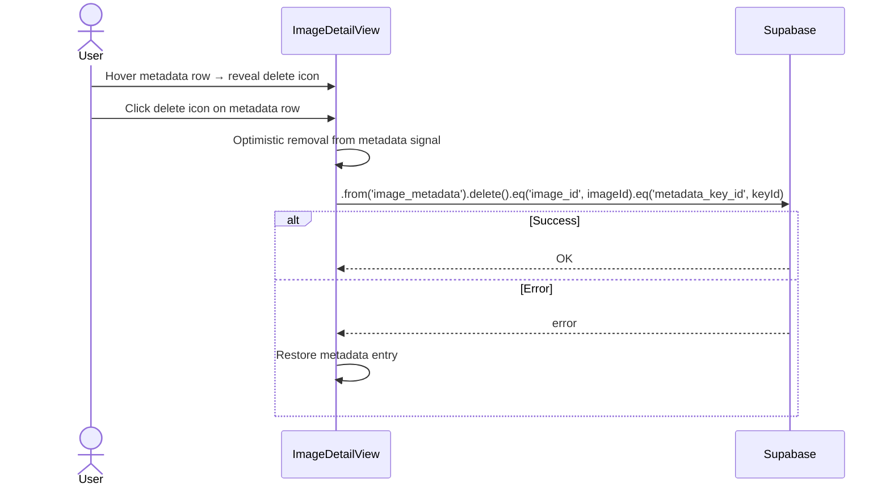
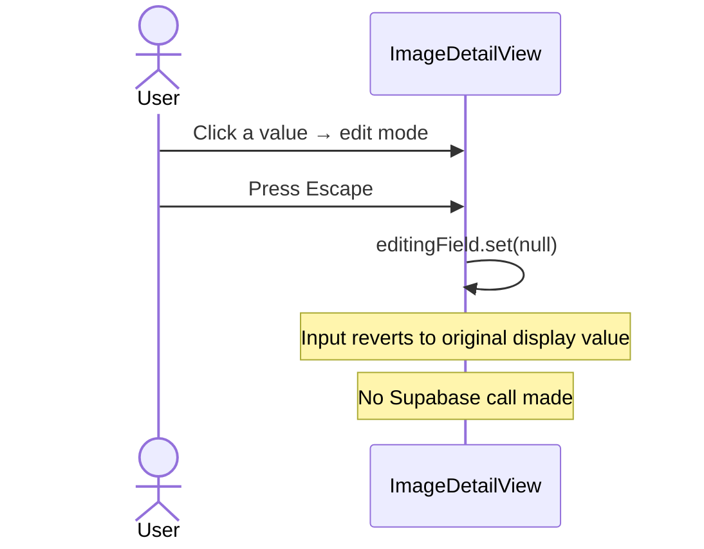
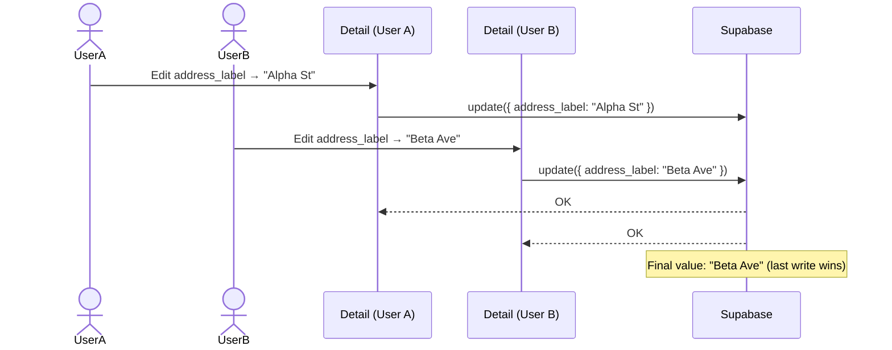
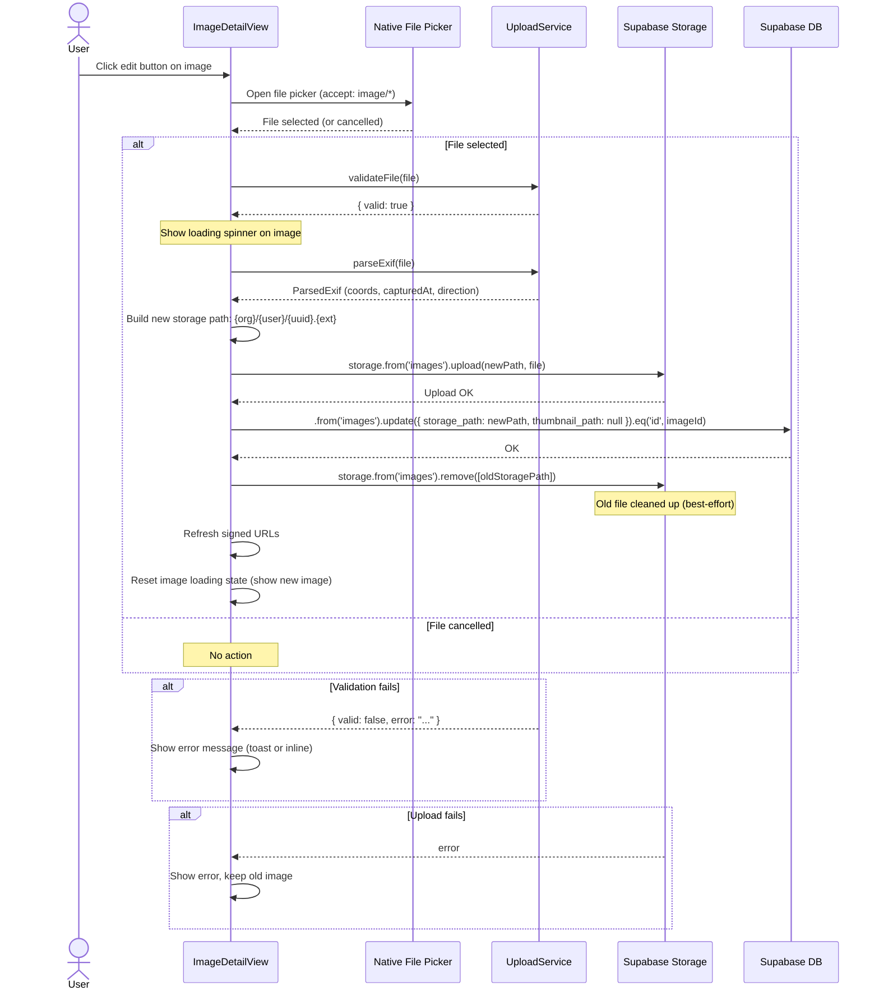

# Image Editing — Use Cases & Interaction Scenarios

> **Related specs:** [image-detail-view](../element-specs/image-detail-view.md), [workspace-view](workspace-view.md)
> **Database:** [database-schema](../database-schema.md) — `images`, `image_metadata`, `metadata_keys`, `projects`

---

## Overview

These scenarios describe how users edit image properties inline from the Image Detail View. All editable fields follow the **Notion pattern**: click the value → inline edit → save on Enter/blur. Changes persist to Supabase with optimistic updates.

### Scenario Index

| ID    | Scenario                              | Persona    |
| ----- | ------------------------------------- | ---------- |
| IE-1  | Edit address label (title)            | Technician |
| IE-2  | Edit captured date                    | Clerk      |
| IE-3  | Change project assignment             | Clerk      |
| IE-4  | Edit custom metadata value            | Technician |
| IE-5  | Add new custom metadata entry         | Clerk      |
| IE-6  | Remove custom metadata entry          | Clerk      |
| IE-7  | Edit address components               | Clerk      |
| IE-8  | Discard edit via Escape               | Any        |
| IE-9  | Concurrent edit conflict (optimistic) | Any        |
| IE-10 | Replace photo file                    | Technician |

---

## IE-1: Edit Address Label (Title)

**Context:** Technician opens image detail and sees the address label at the top. They want to correct the reverse-geocoded label.

```mermaid
sequenceDiagram
    actor User
    participant Detail as ImageDetailView
    participant Supabase

    User->>Detail: Click address label in header
    Detail->>Detail: editingField.set('address_label')
    Note over Detail: Title text becomes an inline <input>

    User->>Detail: Type corrected address, press Enter
    Detail->>Detail: Optimistic update — image().address_label = newValue
    Detail->>Supabase: .from('images').update({ address_label: newValue }).eq('id', imageId)

    alt Success
        Supabase-->>Detail: OK
        Note over Detail: Title shows new value
    else Error
        Supabase-->>Detail: error
        Detail->>Detail: Roll back to previous value
    end
```

**Expected state after:**

- `address_label` column updated in `images` table
- Display title reflects the new label immediately (optimistic)
- If the update fails, the old label is restored

---

## IE-2: Edit Captured Date

**Context:** Clerk notices the captured date is wrong (EXIF data was incorrect or missing). They want to set the correct date.

**Expected state after:**

- `captured_at` updated in `images` table
- Formatted date in the UI reflects new value
- Sort-by-date in workspace view will use the corrected timestamp

---

## IE-3: Change Project Assignment

**Context:** Clerk wants to move an image from one project to another, or assign it to a project for the first time.

```mermaid
sequenceDiagram
    actor User
    participant Detail as ImageDetailView
    participant Supabase

    User->>Detail: Click project value (or "No project")
    Detail->>Detail: editingField.set('project_id')
    Note over Detail: Value becomes a <select> dropdown

    Detail->>Supabase: .from('projects').select('id, name').eq('organization_id', orgId)
    Supabase-->>Detail: projects[]
    Detail->>Detail: projectOptions.set(projects)

    User->>Detail: Select a project from dropdown
    Detail->>Detail: Optimistic update — image().project_id = selectedId
    Detail->>Supabase: .from('images').update({ project_id: selectedId }).eq('id', imageId)

    alt Success
        Supabase-->>Detail: OK
    else Error
        Supabase-->>Detail: error
        Detail->>Detail: Roll back to previous project
    end
```

**Expected state after:**

- `project_id` updated in `images` table
- Project label shown next to the key
- Workspace view grouping-by-project reflects the change on next query

---

## IE-4: Edit Custom Metadata Value

**Context:** Technician clicks a custom metadata value (e.g., "Building type: Residential") and changes it.

```mermaid
sequenceDiagram
    actor User
    participant Detail as ImageDetailView
    participant Row as MetadataPropertyRow
    participant Supabase

    User->>Row: Click value text
    Row->>Row: editing.set(true)
    Note over Row: Value becomes <input> with current text

    User->>Row: Type new value, press Enter
    Row->>Detail: valueChanged.emit(newValue)
    Detail->>Detail: Optimistic update in metadata signal
    Detail->>Supabase: .from('image_metadata').upsert({ image_id, metadata_key_id, value_text: newValue })

    alt Success
        Supabase-->>Detail: OK
    else Error
        Supabase-->>Detail: error
        Detail->>Detail: Roll back metadata entry
    end
```

**Expected state after:**

- `image_metadata.value_text` updated for the given key
- Row displays the new value immediately

---

## IE-5: Add New Custom Metadata Entry

**Context:** Clerk wants to tag the image with a new metadata key that doesn't exist yet.

**Expected state after:**

- New metadata row appears in the list
- `metadata_keys` table has the key (existing or newly created)
- `image_metadata` row created for this image + key

---

## IE-6: Remove Custom Metadata Entry

**Context:** Clerk wants to remove a metadata tag from the image.

**Expected state after:**

- Row removed from UI immediately
- `image_metadata` row deleted
- `metadata_keys` entry is NOT deleted (shared across images)

---

## IE-7: Edit Address Components

**Context:** Clerk edits the structured address fields (street, city, district, country) for more accurate grouping.

```mermaid
sequenceDiagram
    actor User
    participant Detail as ImageDetailView
    participant Supabase

    User->>Detail: Click street/city/district/country value
    Detail->>Detail: editingField.set('street' | 'city' | 'district' | 'country')
    Note over Detail: Value becomes inline <input>

    User->>Detail: Type new value, press Enter
    Detail->>Detail: Optimistic update — image()[field] = newValue
    Detail->>Supabase: .from('images').update({ [field]: newValue }).eq('id', imageId)

    alt Success
        Supabase-->>Detail: OK
    else Error
        Supabase-->>Detail: error
        Detail->>Detail: Roll back
    end
```

**Expected state after:**

- Address component updated in `images` table
- Grouping-by-city/district/street reflects change on next query

---

## IE-8: Discard Edit via Escape

**Context:** User starts editing a field but decides to cancel.

**Expected state after:**

- No database write occurred
- Field shows original value
- Edit mode dismissed

---

## IE-9: Concurrent Edit Conflict (Optimistic)

**Context:** Two users edit the same field on the same image. The second write wins at the DB level. The local user sees their optimistic update; if the network call fails, they see the rollback.

**Expected state after:**

- Database has the last-written value
- Each user's UI reflects their own optimistic write
- No real-time sync — resolved on next load

---

## IE-10: Replace Photo File

**Context:** Technician notices the wrong photo was uploaded for a location, or wants to replace a placeholder/corrupt image with the correct file. They click the edit button overlaid on the image in the detail view.

### Trigger

An **edit button** is overlaid in the **top-right corner** of the image container in the Image Detail View. The button:

- Is **always visible** on touch devices (no hover state available)
- Appears **on hover** on desktop — the button fades in when the cursor enters the image area
- Uses a semi-transparent scrim background for contrast against any image content
- Uses the `edit` Material Icon

### Flow

### EXIF Handling on Replace

When a photo is replaced, the new file's EXIF data is parsed but **NOT** used to overwrite location fields. The rationale:

- The image record already has user-verified location data (possibly manually corrected)
- Overwriting coordinates would lose corrections
- The `exif_latitude`/`exif_longitude` columns are **not** updated — they reflect the original upload's EXIF
- `captured_at` is **not** updated — the user may have already corrected this field

If the user wants to update location or date from the new file's EXIF, they can do so manually via the existing inline edit flows (IE-1 through IE-7).

### Constraints

- File must pass `UploadService.validateFile()` (25 MB max, allowed MIME types)
- Only the file owner or org admin can replace (enforced by RLS on `images` update)
- Old storage file is deleted best-effort — a failed cleanup doesn't block the operation
- `thumbnail_path` is set to `null` after replace since the old thumbnail no longer matches. A new thumbnail can be regenerated server-side.

**Expected state after:**

- `storage_path` updated in `images` table to the new file path
- `thumbnail_path` set to `null` (old thumbnail invalidated)
- Old file removed from Supabase Storage (best-effort)
- Image display refreshes to show the new photo
- All metadata (address, project, coordinates, custom fields) remains unchanged
