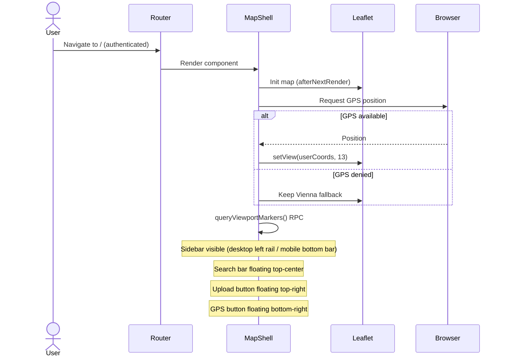
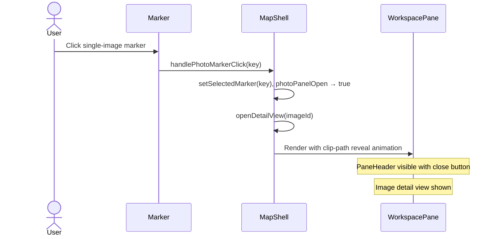
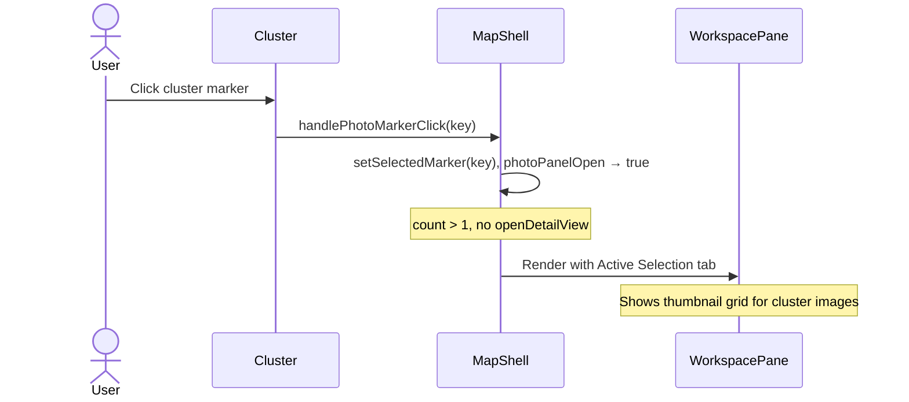
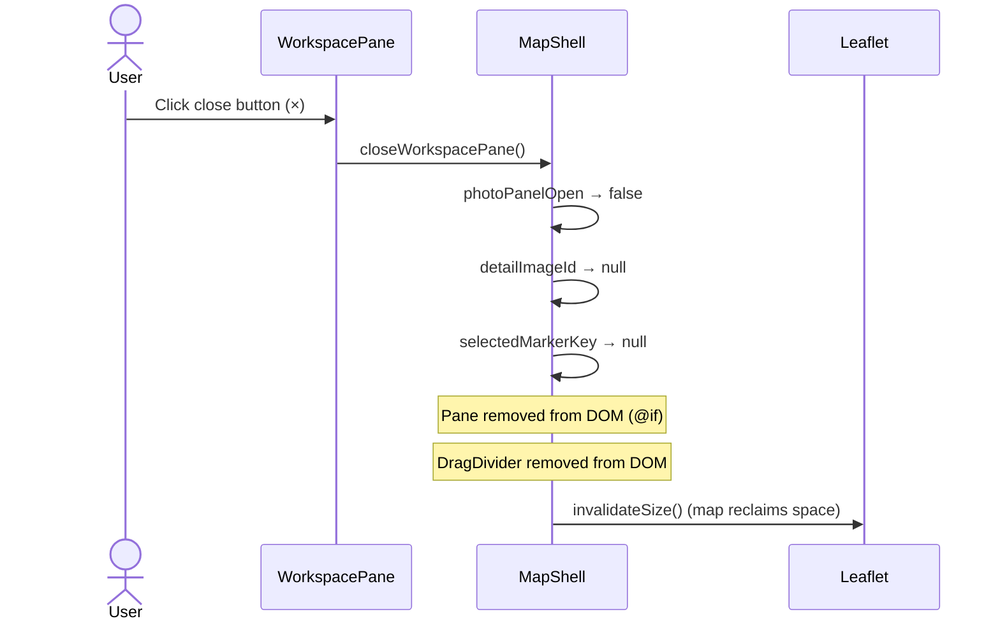
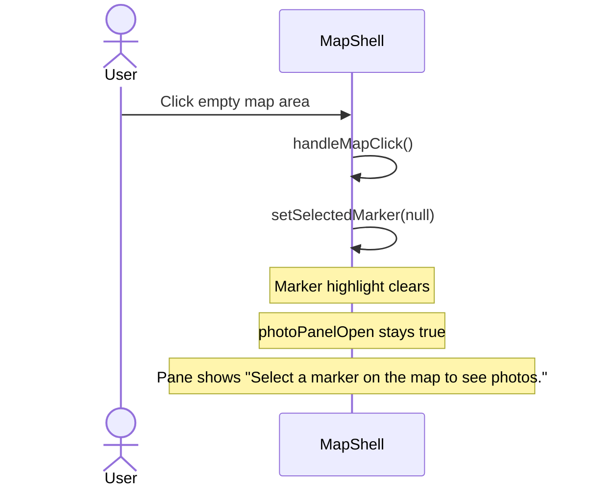
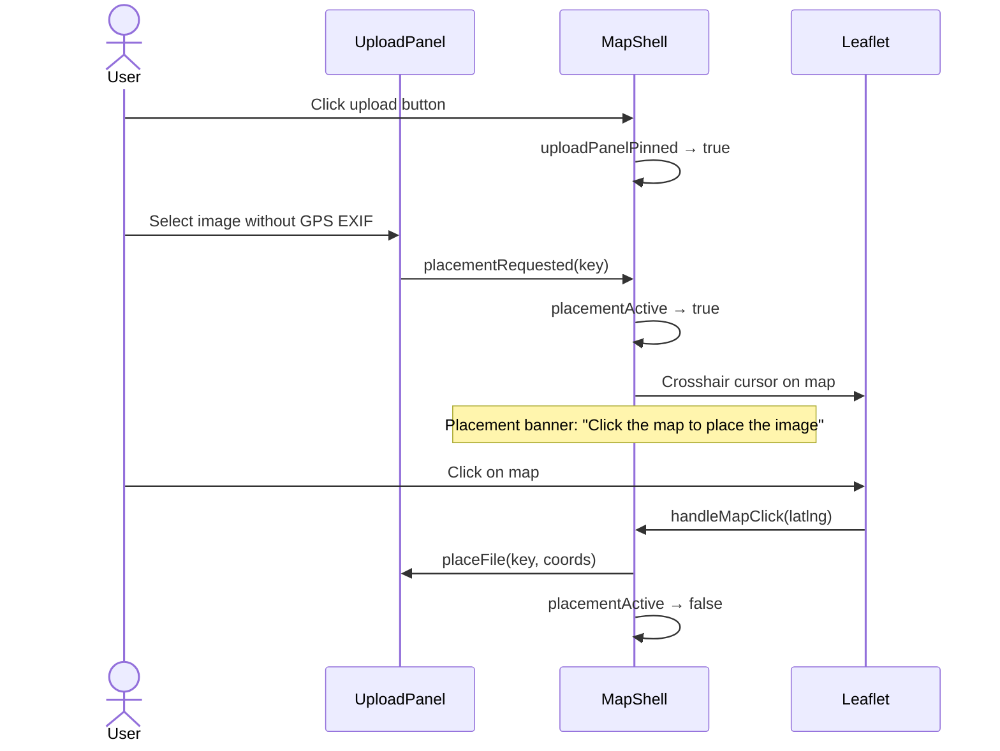
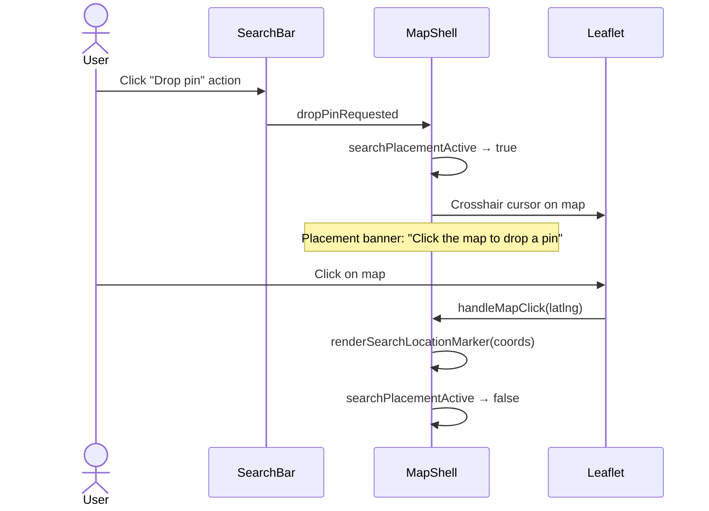

# Map Shell — Interaction Scenarios

> **Element spec:** [element-specs/map-shell.md](../element-specs/map-shell.md)
> **Blueprint:** [implementation-blueprints/map-shell.md](../implementation-blueprints/map-shell.md)
> **Product use cases:** [UC1](README.md#uc1--technician-on-site-view-history), [UC2](README.md#uc2--clerk-preparing-a-quote), [UC3](README.md#uc3--upload-and-correct-a-new-image)
> **Related specs:** [workspace-pane](../element-specs/workspace-pane.md), [drag-divider](../element-specs/drag-divider.md), [search-bar](../element-specs/search-bar.md), [upload-button-zone](../element-specs/upload-button-zone.md), [photo-marker](../element-specs/photo-marker.md), [image-detail-view](../element-specs/image-detail-view.md)

---

## IS-1: Initial Map Load (spec Actions #1)

**Product context:** Every UC begins here. The technician (UC1) or clerk (UC2) sees the map immediately after login.

**Expected state after:**

- `placementActive` = false
- `searchPlacementActive` = false
- `uploadPanelOpen` = false
- `workspacePaneOpen` = false
- Map renders with markers from viewport query

---

## IS-2: Open Workspace Pane via Marker Click (spec Actions #3)

**Product context:** UC1 step 6 (tap marker), UC2 step 6 (browse markers).
**Related:** [photo-marker spec](../element-specs/photo-marker.md) §Cluster Click, [workspace-pane spec](../element-specs/workspace-pane.md) §1/§1b

**For cluster markers:**

---

## IS-3: Close Workspace Pane (spec Actions #6)

**Product context:** User is done reviewing; wants to return to map-only view.
**Related:** [workspace-pane spec](../element-specs/workspace-pane.md) §3

**Expected state after:**

- `workspacePaneOpen / photoPanelOpen` = false
- `detailImageId` = null
- `selectedMarkerKey` = null

---

## IS-4: Click Empty Map While Pane Open (spec Actions #7)

**Product context:** User clicks a blank area on the map. Deselects the marker but keeps the pane open for continued browsing.

---

## IS-5: Upload and Placement Mode (spec Actions #4, #5)

**Product context:** UC3 — upload a new image, place it if no EXIF GPS.
**Related:** [upload-button-zone spec](../element-specs/upload-button-zone.md)

### Search pin-drop variant (spec Actions #5):

---

## IS-6: Browser Resize — Responsive Reflow (spec Actions #2)

**Product context:** Technician switches orientation on tablet, or clerk resizes browser window.

| Breakpoint | Sidebar                     | Workspace Pane           | Upload |
| ---------- | --------------------------- | ------------------------ | ------ |
| ≥ 768px    | Left rail (floating, icons) | Right panel with divider | FAB    |
| < 768px    | Bottom tab bar (full width) | Bottom sheet (40vh)      | FAB    |

No JS needed — CSS media queries handle the reflow. `NavComponent` handles sidebar transformation independently.

---

## Signal naming note

The spec uses `workspacePaneOpen` as the canonical signal name. The current code uses `photoPanelOpen`. These refer to the same state. A rename is planned but deferred to avoid unnecessary churn during active development.
