# Photo Grouping — Data Sources & Derivation

> **Related specs:** [grouping-dropdown](../element-specs/grouping-dropdown.md), [workspace-view-system](../element-specs/workspace-view-system.md), [workspace-toolbar](../element-specs/workspace-toolbar.md)
> **Related use cases:** [workspace-view WV-4, WV-5](workspace-view.md)

---

## Overview

Photos can be grouped by various properties. Some properties are stored directly on each image row, some are derived from other fields at query time or on the client, and some require external resolution (reverse geocoding). This document maps every grouping property to its data source, derivation logic, and fallback behaviour.

---

## Grouping Property Matrix

| Property     | DB Column(s)              | Source                     | Derivation                                      | Fallback Label       |
| ------------ | ------------------------- | -------------------------- | ----------------------------------------------- | -------------------- |
| **Date**     | `captured_at`             | EXIF extraction at upload  | `toLocaleDateString(full)`                      | `"Unknown date"`     |
| **Year**     | `captured_at`             | EXIF extraction at upload  | `getFullYear()`                                 | `"Unknown year"`     |
| **Month**    | `captured_at`             | EXIF extraction at upload  | `toLocaleDateString(year+month)` → "March 2026" | `"Unknown month"`    |
| **Project**  | `project_id` → `projects` | User assignment at upload  | JOIN project name                               | `"No project"`       |
| **City**     | `city`                    | Reverse geocoding from GPS | Stored directly after address resolution        | `"Unknown city"`     |
| **Country**  | `country`                 | Reverse geocoding from GPS | Stored directly after address resolution        | `"Unknown country"`  |
| **Street**   | `street`                  | Reverse geocoding from GPS | Stored directly after address resolution        | `"Unknown street"`   |
| **District** | `district`                | Reverse geocoding from GPS | Stored directly after address resolution        | `"Unknown district"` |
| **Address**  | `address_label`           | Reverse geocoding / manual | Full human-readable label                       | `"Unknown address"`  |
| **User**     | `user_id` → `profiles`    | Auth at upload             | JOIN profile full_name                          | `"Unknown user"`     |

---

## Data Flow: How Address Fields Get Populated

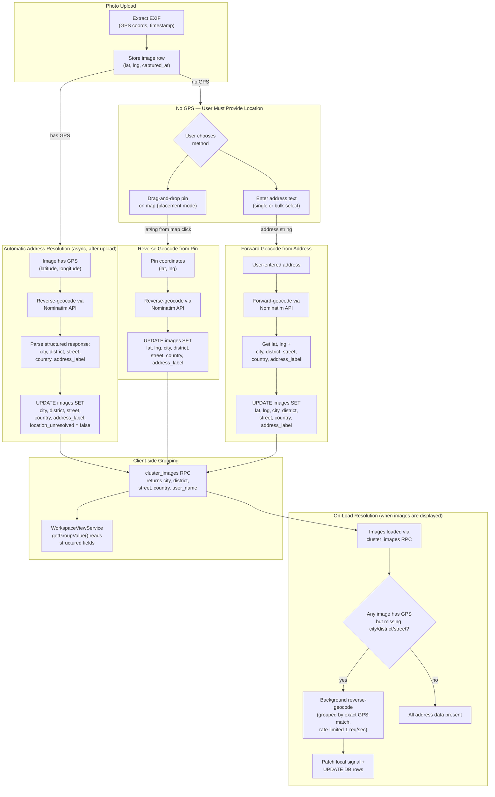

> **Note:** On-load resolution is a safety net — it catches images where the upload-time geocode failed or was skipped (e.g., old data, manual pin placement before geocoding was wired). Once resolved, the address data persists in the DB and is never re-fetched.

---

## Data Flow: Date-Derived Groupings

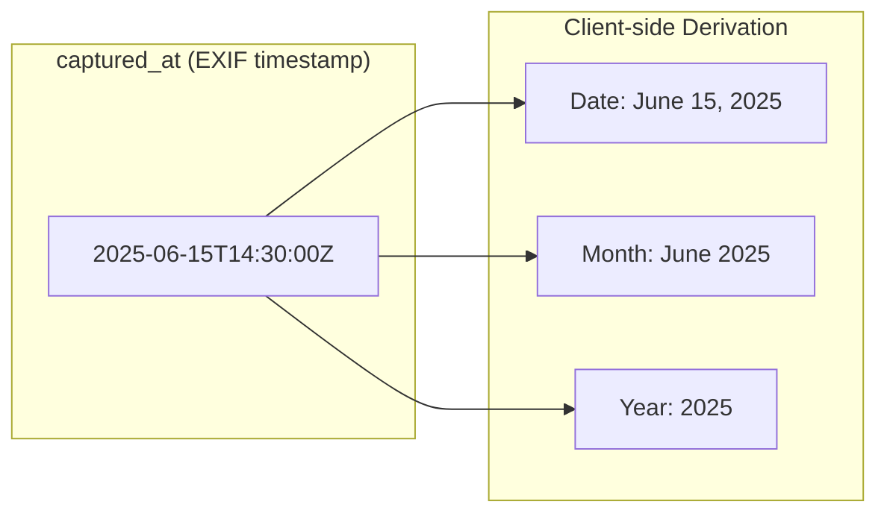

No extra DB columns needed — `captured_at` is parsed on the client into date, month, or year labels.

---

## Data Flow: User Grouping

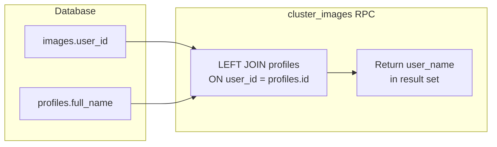

The `cluster_images` RPC joins `profiles` to return the uploader's name alongside each image.

---

## Use Cases

### UC-G1: Grouping by City (address already resolved)

**Precondition:** Images have been reverse-geocoded; `city` column is populated.

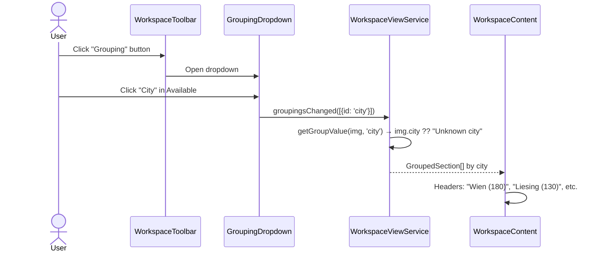

### UC-G2: Grouping by Year

**Precondition:** Images have `captured_at` timestamps from EXIF.

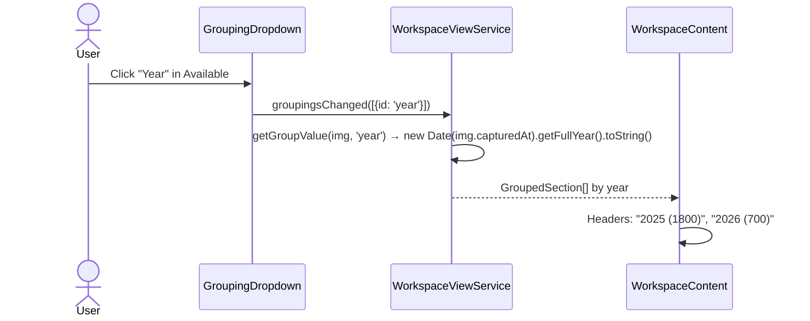

### UC-G3: Grouping by Street

**Precondition:** Images have been reverse-geocoded; `street` column is populated.

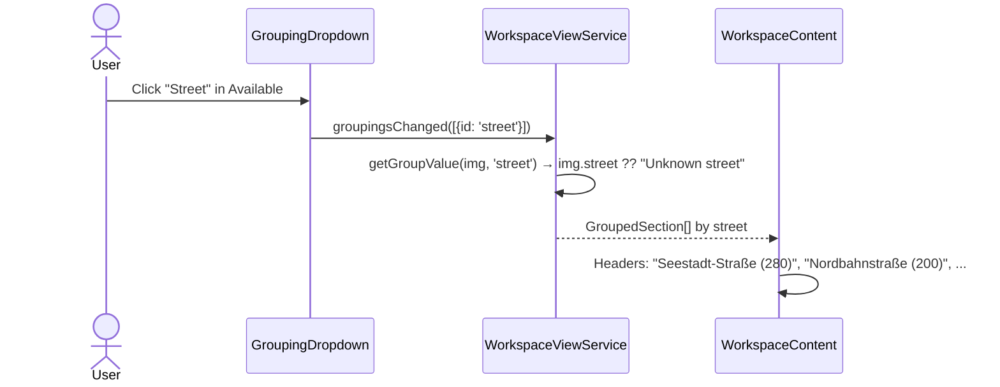

### UC-G4: Multi-level — Country → City → Project

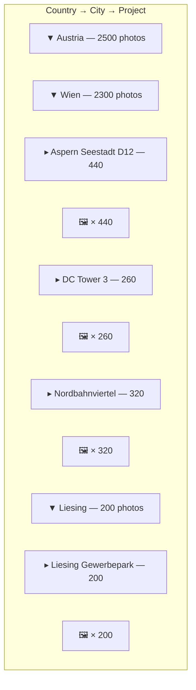

### UC-G5: Grouping by User

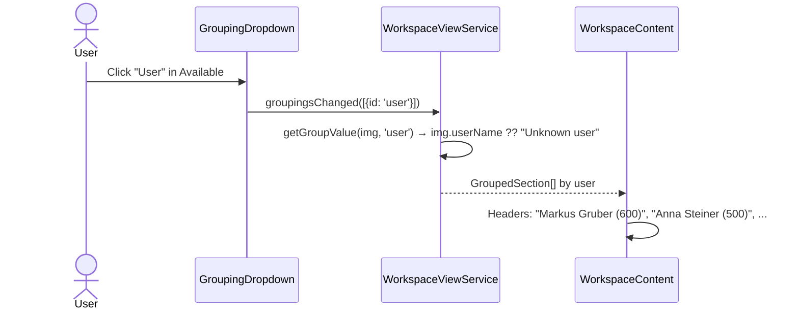

### UC-G6: Address Fields Not Yet Resolved — On-Load Background Resolution

**Precondition:** Fresh upload or old data; reverse geocoding hasn't run yet. Images have GPS but no address fields.

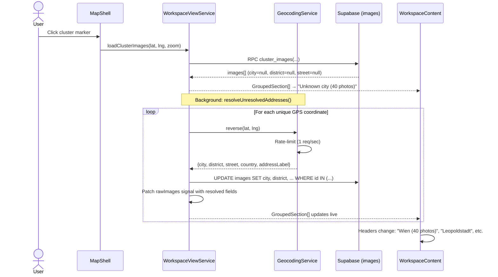

### UC-G7: Photo Without EXIF — Pin Placement → Reverse Geocode

**Precondition:** User uploads a photo without EXIF GPS data. No coordinates or address are known.

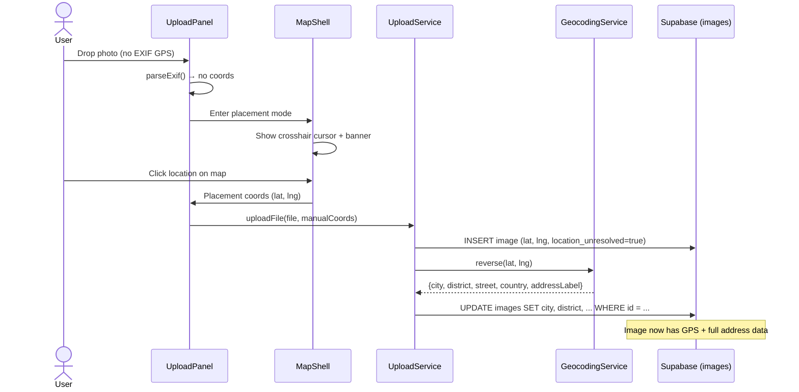

### UC-G8: Photo Without EXIF — Manual Address Entry → Forward Geocode

**Precondition:** User uploads a photo without EXIF GPS data. User enters an address instead of placing a pin.

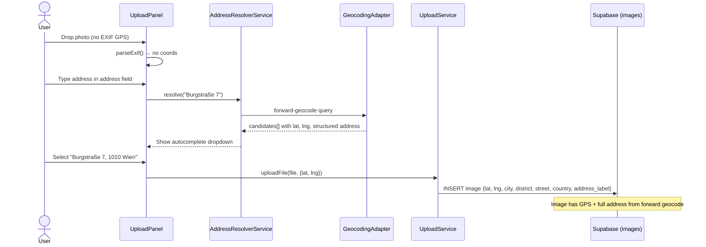

### UC-G9: Bulk Address Entry — Select Multiple Photos

**Precondition:** Multiple uploaded photos without GPS data. User selects them and enters an address for all.

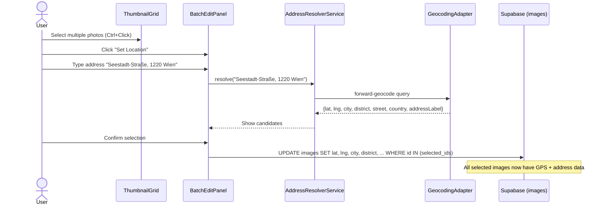

---

## Address Resolution Strategies

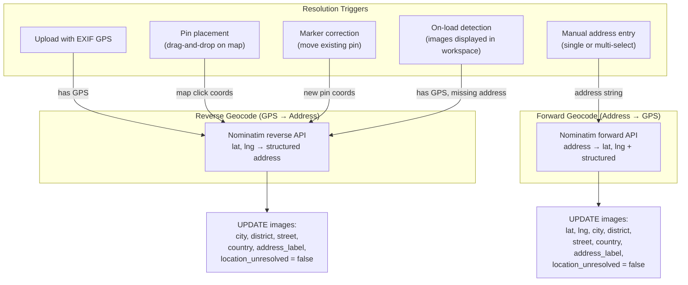

| Trigger                            | Method                   | Fields Populated                                                                  | Timing                 |
| ---------------------------------- | ------------------------ | --------------------------------------------------------------------------------- | ---------------------- |
| Upload with EXIF GPS               | Reverse geocode GPS→addr | `address_label`, `city`, `district`, `street`, `country`                          | Async, after insert    |
| Pin placement (no EXIF)            | Reverse geocode GPS→addr | `address_label`, `city`, `district`, `street`, `country`                          | Async, after insert    |
| Manual address entry (single/bulk) | Forward geocode addr→GPS | `latitude`, `longitude`, `address_label`, `city`, `district`, `street`, `country` | On confirm             |
| Marker correction                  | Reverse geocode new GPS  | Updates all address fields for new location                                       | Async, after move      |
| Folder import (filename hint)      | Forward geocode hint→GPS | All address fields + coordinates                                                  | Batch, during import   |
| On-load detection (workspace view) | Reverse geocode GPS→addr | `address_label`, `city`, `district`, `street`, `country`                          | Background, on display |

All strategies ultimately populate the same structured columns on the `images` table.
