# Photo Loading — Use Cases & Interaction Scenarios

> **Related specs:** [photo-marker](../element-specs/photo-marker.md), [thumbnail-card](../element-specs/thumbnail-card.md), [thumbnail-grid](../element-specs/thumbnail-grid.md), [image-detail-view](../element-specs/image-detail-view.md)
> **Storage docs:** Supabase Storage Image Transformations (signed URLs with `transform` options)

---

## Overview

Photos flow through a **four-tier progressive loading pipeline**. Each tier serves a different surface at a different resolution. Placeholder images fill every tier until a real file exists in Supabase Storage, ensuring the UI never shows a blank marker or broken ``.

### Tier Summary

| Tier | Surface                     | Resolution     | Source                                                      | Fallback                          |
| ---- | --------------------------- | -------------- | ----------------------------------------------------------- | --------------------------------- |
| 0    | Map marker (far/mid zoom)   | None (no img)  | Count badge only                                            | —                                 |
| 1    | Map marker (near zoom ≥ 16) | 80 × 80 px     | Signed URL + `transform { width: 80, height: 80, cover }`   | CSS placeholder (gradient + icon) |
| 2    | Thumbnail Grid card         | 256 × 256 px   | Signed URL + `transform { width: 256, height: 256, cover }` | CSS placeholder (gradient + icon) |
| 3    | Image Detail View           | Original / max | Signed URL (no transform, or capped at 2500px)              | Tier 2 URL shown while loading    |

---

## PL-1: Marker Enters Viewport at Near Zoom

**Context:** User pans or zooms so that single-image markers appear at zoom ≥ 16. The viewport query returns rows with `storage_path` / `thumbnail_path`. No thumbnail URL is loaded yet.

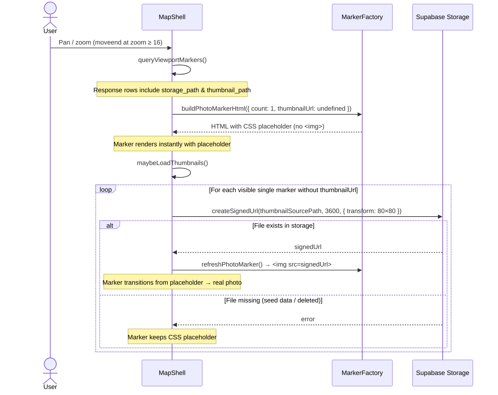

**Expected state after:**

- Markers with real storage files show photo thumbnails
- Markers without storage files show a styled CSS placeholder (not a broken image icon)

---

## PL-2: Thumbnail Grid Loads for Active Selection

**Context:** User clicks a marker or cluster → Workspace Pane opens → Thumbnail Grid renders. Each card needs a 256×256 thumbnail. Signing is triggered immediately by `WorkspaceViewService.loadMultiClusterImages()` after setting `rawImages`.

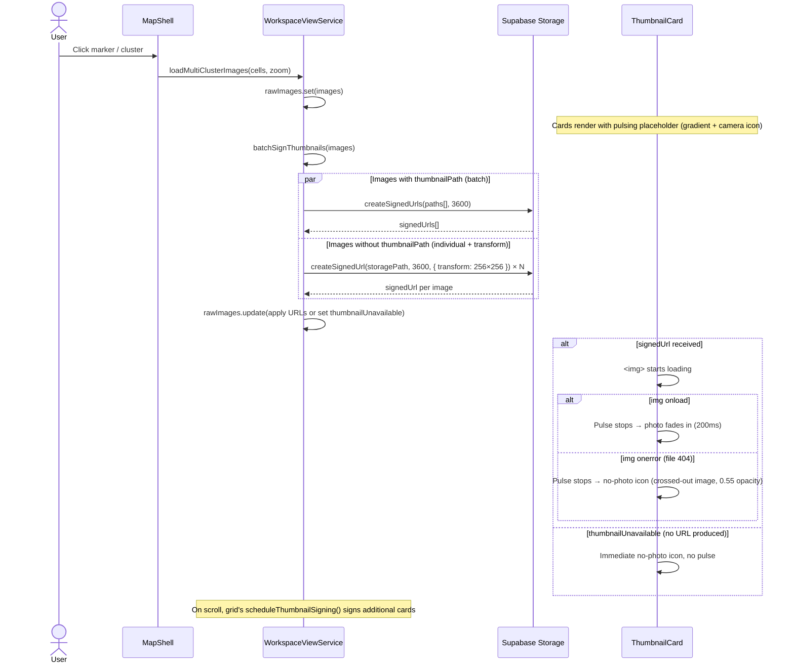

**Expected state after:**

- Cards pulse while signed URLs are being fetched and images are downloading
- Cards with real storage files show photo thumbnails (fade-in)
- Cards where the file is missing show a static no-photo icon (crossed-out image)
- `thumbnailUnavailable` flag prevents re-signing on scroll
- No broken `` icons anywhere

---

## PL-3: Image Detail View Opens

**Context:** User clicks a thumbnail card → Image Detail View replaces the grid. Needs to load the full-resolution image progressively.

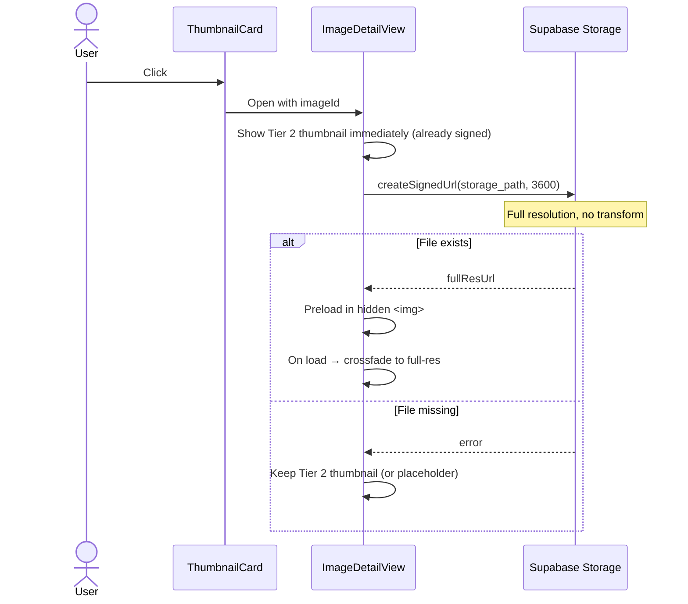

**Expected state after:**

- Thumbnail (Tier 2) shows instantly
- Full-resolution image fades in once loaded
- If no file exists, Tier 2 or placeholder remains
- `fullResLoaded` signal is `true` once the high-res image completes

---

## PL-4: Fresh Upload — Optimistic Marker + Real Thumbnail

**Context:** User uploads a photo via Upload Panel. The client has the local `File` object and can create an `ObjectURL` immediately.

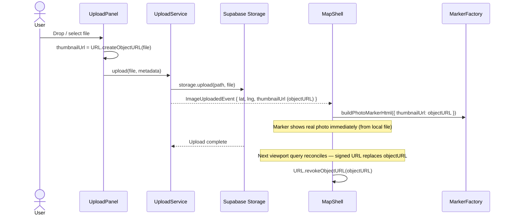

**Expected state after:**

- Marker shows real photo thumbnail from the moment of upload
- No placeholder needed — the local `File` blob serves as the thumbnail
- After viewport reconciliation, the signed storage URL takes over

---

## PL-5: Zoom Out — Thumbnail to Count Badge Transition

**Context:** User zooms out from near (≥ 16) to mid/far zoom (< 16). Individual markers collapse into clusters and thumbnails are no longer needed.

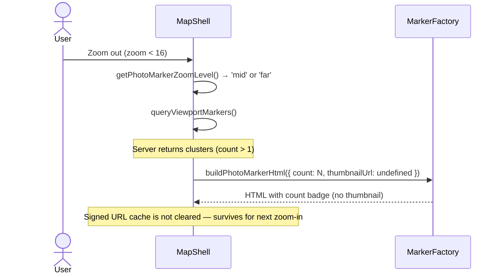

**Expected state after:**

- Cluster markers show count badges
- Thumbnail URLs from previous near-zoom session are retained in `PhotoMarkerState.thumbnailUrl`
- Re-zooming to near zoom re-renders thumbnails instantly from cache

---

## PL-6: Signed URL Expiry & Refresh

**Context:** User stays on the map for >1 hour. Signed URLs expire (default TTL: 3600s). Thumbnails fail to load.

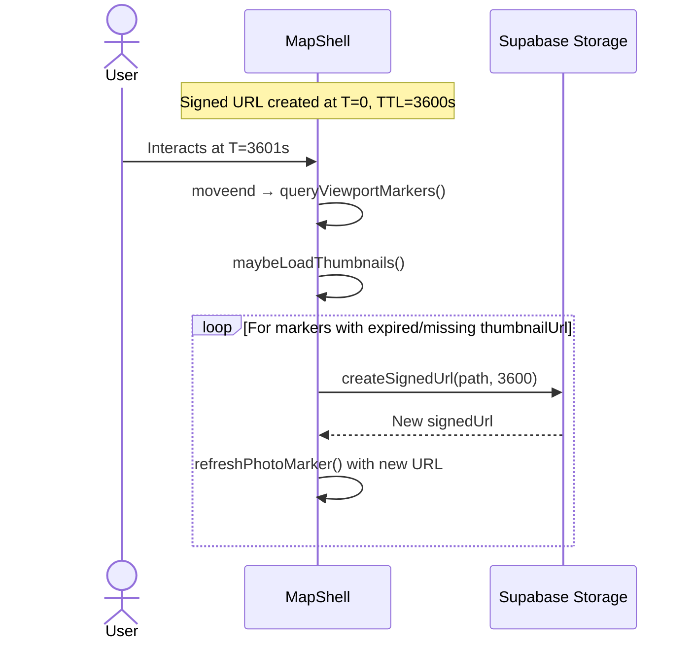

**Strategy:** On each viewport query, clear `thumbnailUrl` for markers whose URL was signed > 50 minutes ago (proactive refresh before expiry). This avoids flicker from expired URLs.

---

## PL-7: Replace Photo — Loading State Reset

**Context:** User replaces a photo through the Image Detail View. `UploadManagerService.replaceFile()` handles the pipeline and emits `imageReplaced$` with a `localObjectUrl` (blob from `URL.createObjectURL(file)`). All surfaces that display this image must reset their loading cycle and show the new photo.

Because `localObjectUrl` is a local blob URL, `` load completes in ~0ms — the pulsing placeholder phase is imperceptibly brief. The loading state machine still cycles through all states (ensuring animations fire correctly), but the user perceives an instant swap.

### Marker (Tier 1) — Instant Rebuild

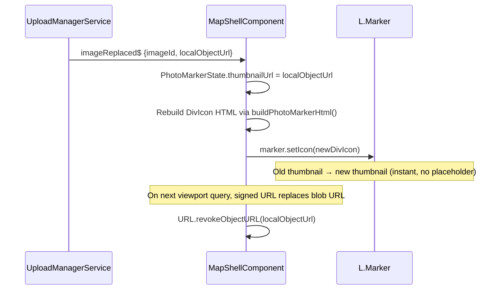

The marker skips the placeholder entirely — `buildPhotoMarkerHtml()` receives a thumbnail URL on first render, so it emits `` directly. Same pattern as PL-4 (Fresh Upload).

### Thumbnail Card (Tier 2) — Loading Cycle Reset

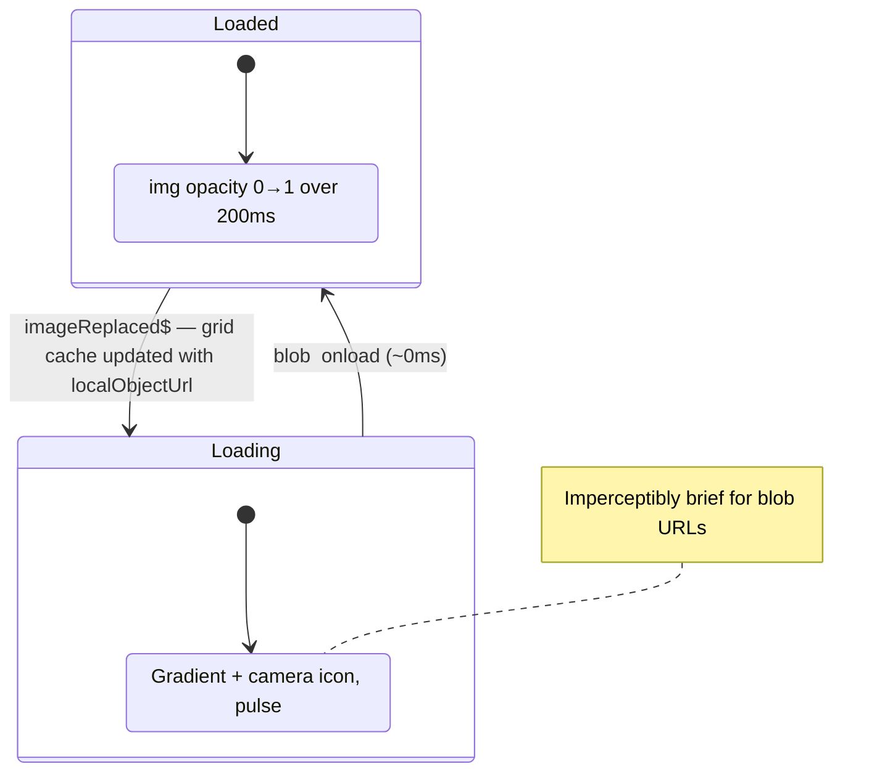

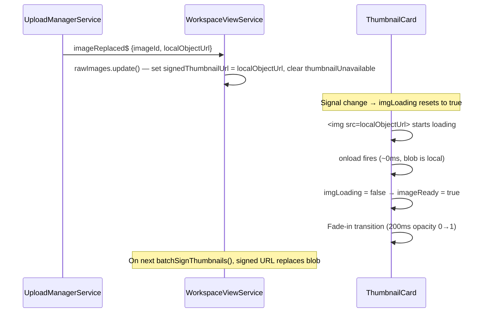

### Detail View (Tier 3) — Progressive Reload

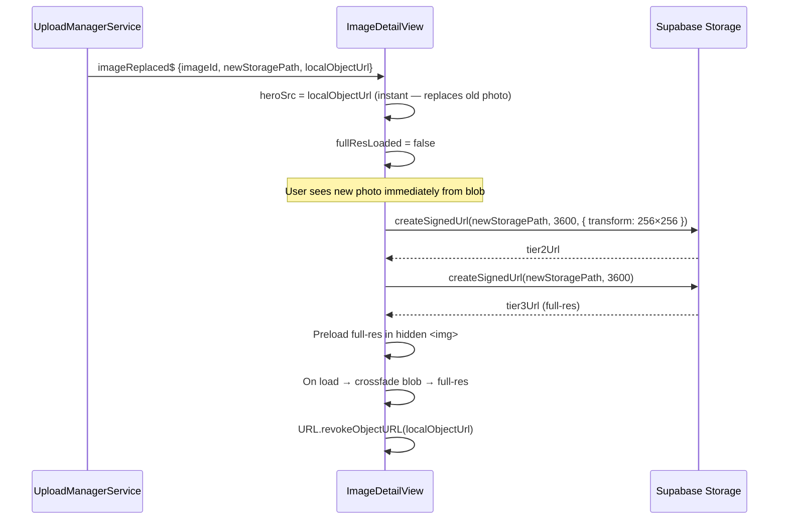

**Expected state after:**

- All three surfaces show the new photo within milliseconds of `imageReplaced$`
- Marker and card use `localObjectUrl` as a bridge — signed URLs take over on next viewport query or batch sign
- Detail view shows blob immediately, then crossfades to full-res signed URL
- No visible placeholder flash (blob loads too fast for the pulse animation to be perceptible)
- `localObjectUrl` is revoked after signed URLs take over to avoid memory leaks

---

## PL-8: Attach Photo to Photoless Row — Loading State Transition

**Context:** User uploads a photo to a photoless datapoint (image row with `storage_path IS NULL`) via the Image Detail View. `UploadManagerService.attachFile()` handles the pipeline and emits `imageAttached$` with a `localObjectUrl`. All surfaces transition from the no-photo state to showing a real image.

Unlike PL-7 (replace), these surfaces start in the **NoPhoto** state — the transition is more visually dramatic: a static "no image" placeholder transforms into a real photo.

### Marker (Tier 1) — Placeholder to Photo

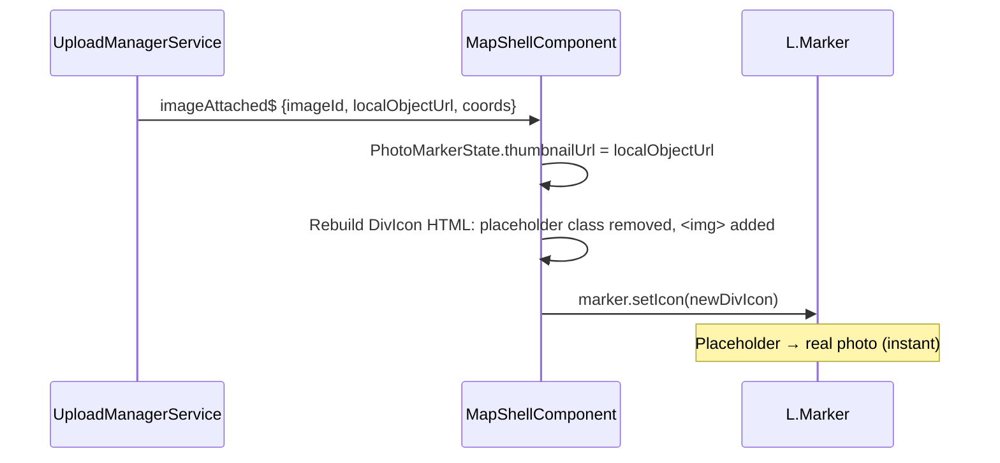

### Thumbnail Card (Tier 2) — NoPhoto to Loaded

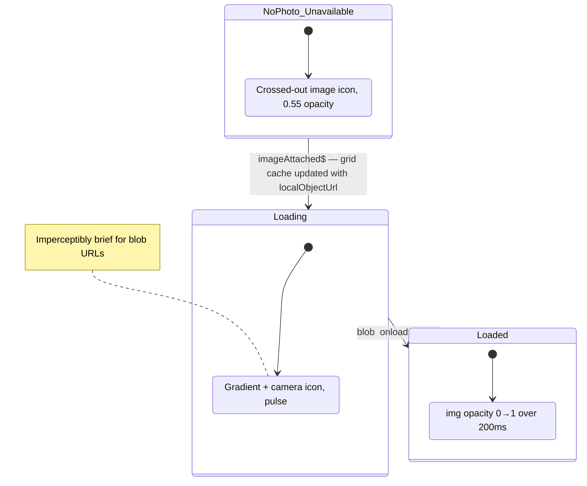

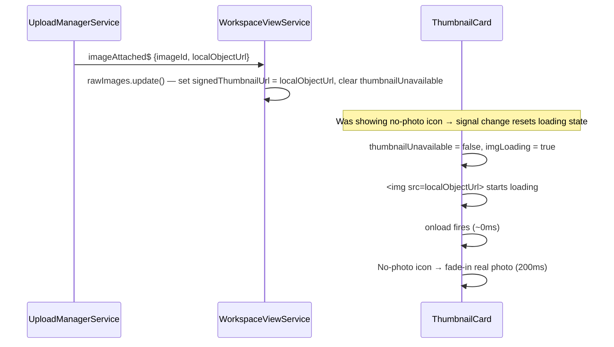

### Detail View (Tier 3) — Upload Prompt to Photo

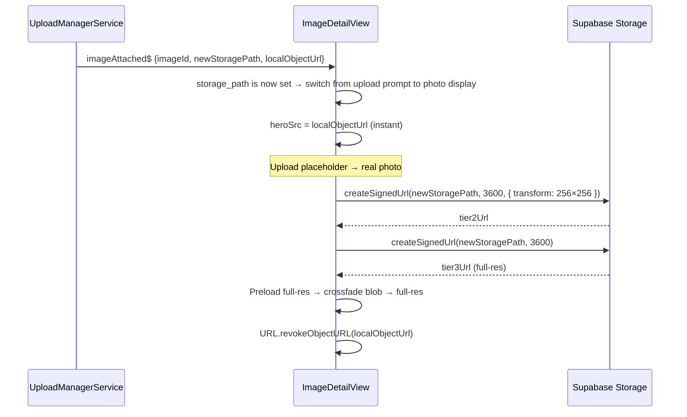

**Expected state after:**

- All three surfaces transition from no-photo state to showing the real photo
- Marker: CSS placeholder class removed, `` added with blob URL
- Card: no-photo icon replaced by real photo via the standard fade-in transition
- Detail view: upload prompt disappears, hero photo shows blob then crossfades to full-res
- EXIF metadata (GPS, direction, captured_at) written to the row by the attach pipeline
- If the row previously had no coordinates, the marker position may update based on EXIF GPS

---

## Placeholder Design

When no real image file exists in Supabase Storage (seed data, deleted files, failed uploads), the placeholder must:

1. **Visually communicate "photo expected here"** — not a broken image icon
2. **Match the marker / card geometry exactly** — same border-radius, same aspect ratio
3. **Be lightweight** — no network request, pure CSS
4. **Be deterministic** — same image ID always produces the same visual (for consistency across reloads)

### Marker Placeholder (Tier 1)

The marker body shows a subtle camera icon (`📷`) centered on a neutral gradient background. The gradient hue is derived deterministically from the marker key hash (so each placeholder looks slightly different).

```
.map-photo-marker__body--placeholder {
  background: linear-gradient(135deg, var(--color-bg-subtle), var(--color-bg-muted));
  display: flex;
  align-items: center;
  justify-content: center;
}
.map-photo-marker__body--placeholder::after {
  content: '';
  width: 60%;
  height: 60%;
  background: var(--color-fg-muted);
  mask-image: url("data:image/svg+xml,...camera-icon...");
  mask-size: contain;
}
```

### Thumbnail Card Placeholder (Tier 2)

Same concept scaled to 128×128px. Shows a camera icon on a soft gradient. The date overlay and project badge still render normally.

### Image Detail Placeholder (Tier 3)

Full-width area with centered camera icon and "Image unavailable" text below. Uses the same gradient approach.
