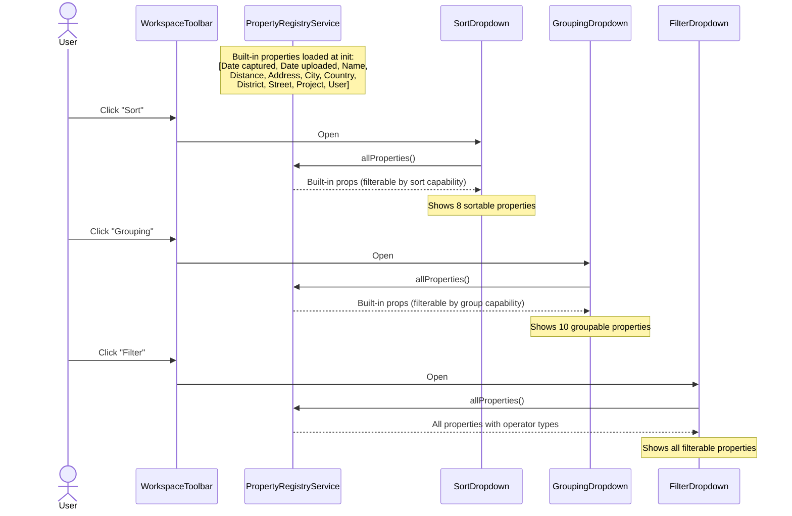
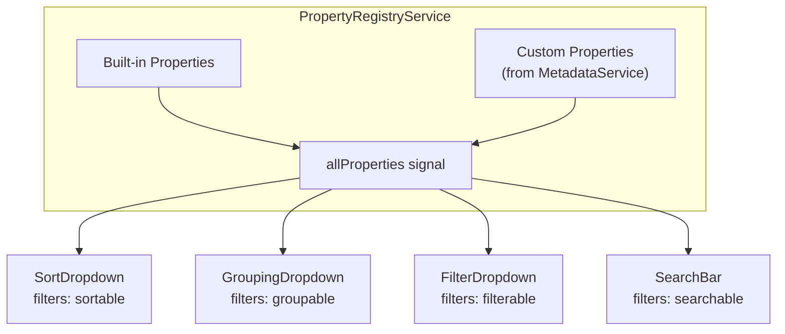
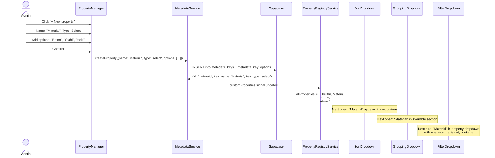
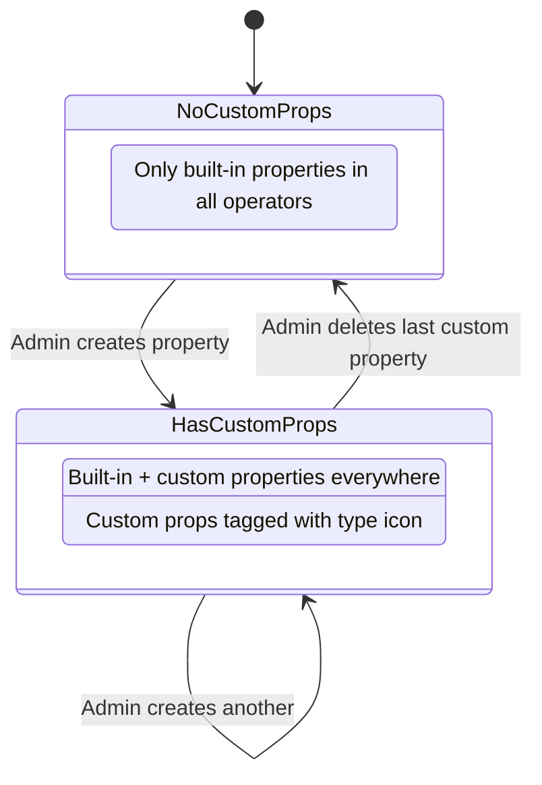
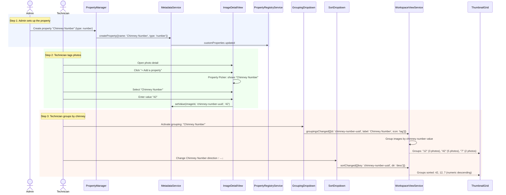
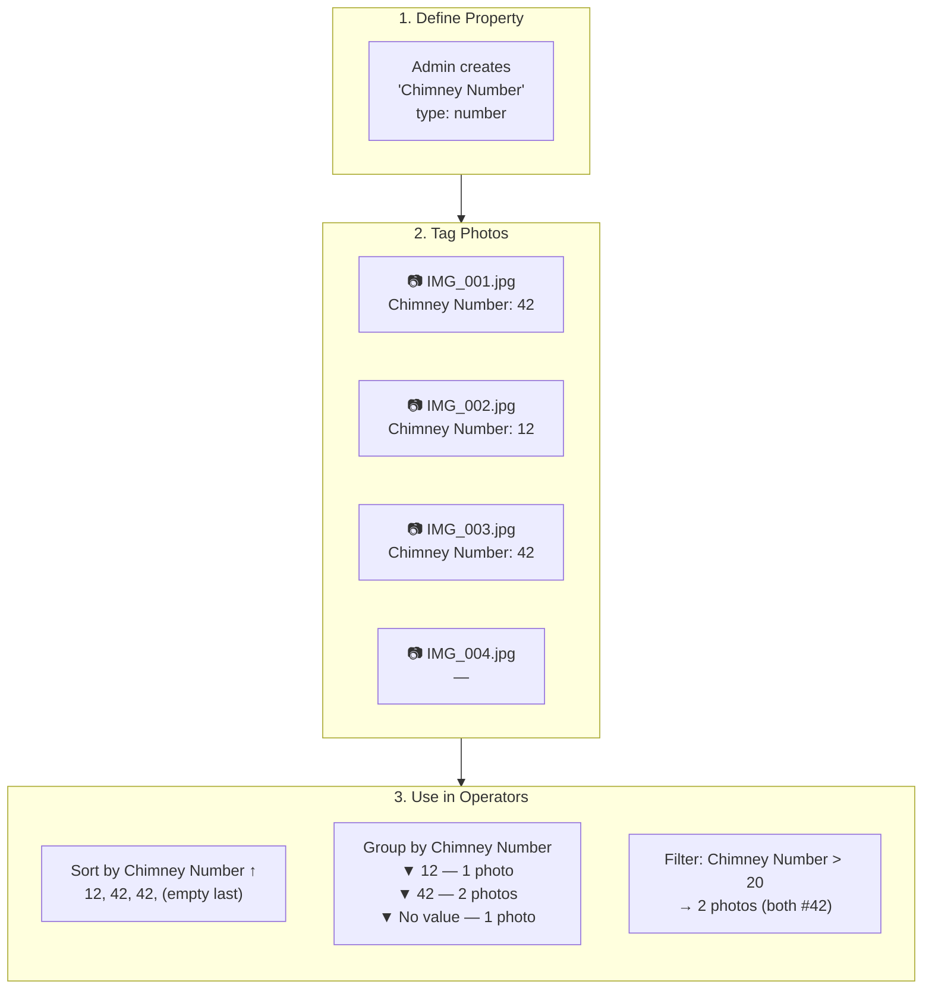
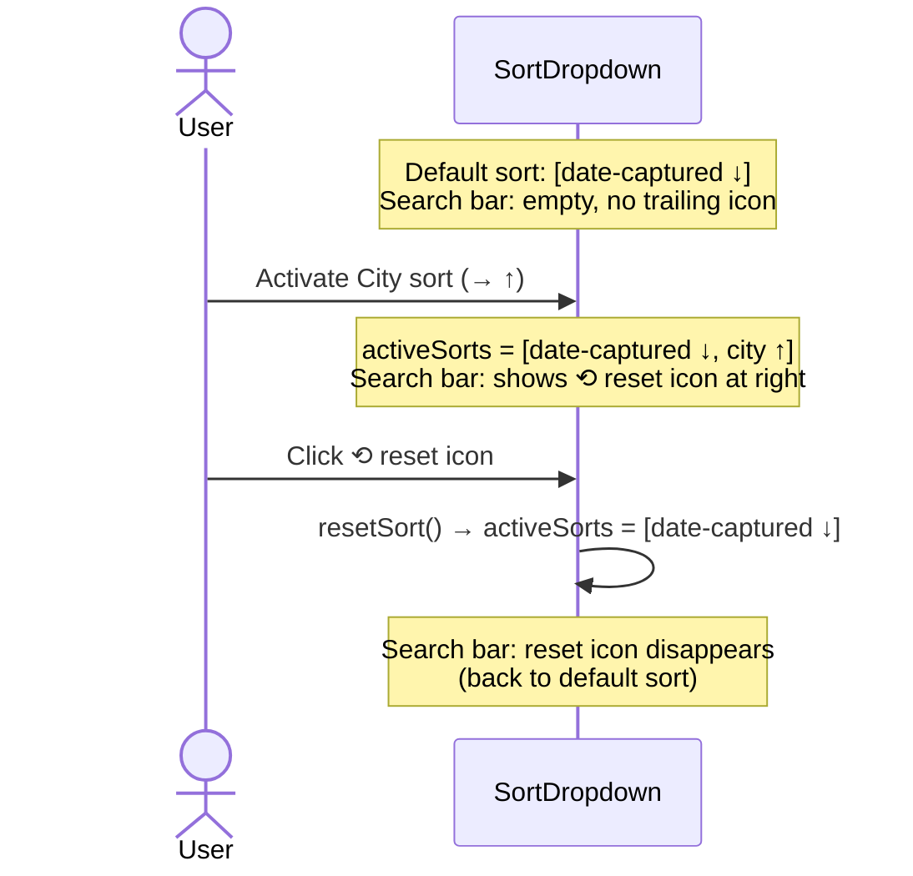
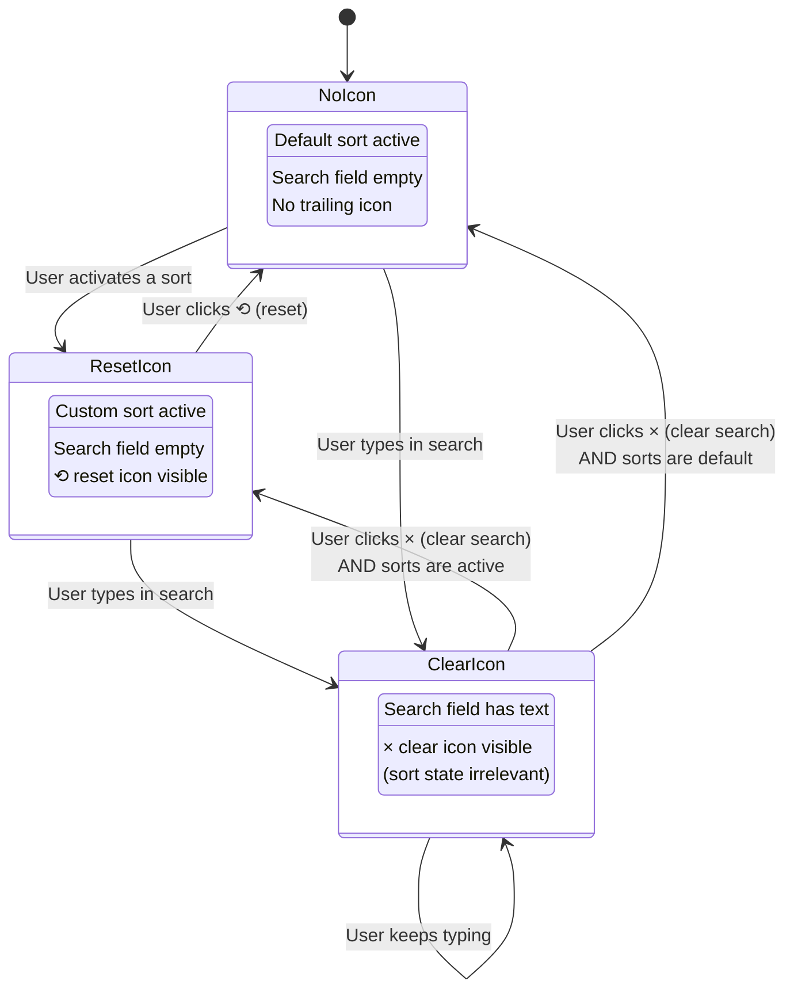
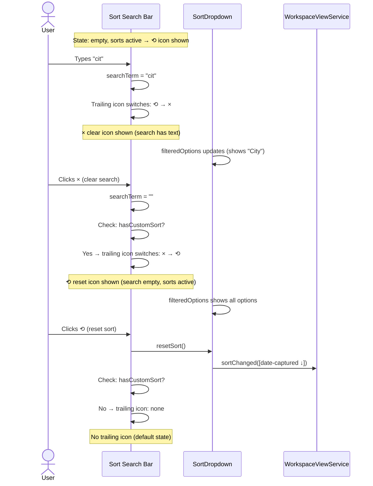
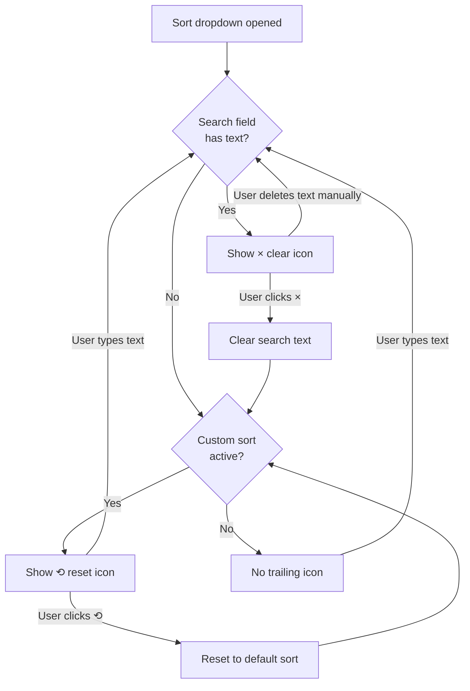

# Property Registry — Use Cases & Interaction Scenarios

> **Related specs:** [custom-properties](../element-specs/custom-properties.md), [sort-dropdown](../element-specs/sort-dropdown.md), [grouping-dropdown](../element-specs/grouping-dropdown.md), [filter-dropdown](../element-specs/filter-dropdown.md), [search-bar](../element-specs/search-bar.md)
> **Related use cases:** [workspace-view WV-3, WV-4, WV-6](workspace-view.md)

---

## Overview

Feldpost has four operators that act on image properties: **Sort**, **Grouping**, **Filter**, and **Search**. Each operator currently maintains its own hardcoded list of available properties. This leads to inconsistency — a property available for grouping may not appear in sort or filter.

The **Property Registry** is a shared service that owns the canonical list of available properties (built-in + custom). All operators consume from this single source. When a user creates a custom property (e.g., "Chimney Number"), it automatically appears in all four operators.

### Scenario Index

| ID   | Scenario                                    | Persona       |
| ---- | ------------------------------------------- | ------------- |
| PR-1 | Built-in properties shared across operators | Clerk         |
| PR-2 | Custom property appears in all operators    | Administrator |
| PR-3 | Chimney inspection workflow                 | Technician    |
| PR-4 | Sort reset from search bar                  | Clerk         |
| PR-5 | Sort search → clear → reset flow            | Clerk         |

---

## PR-1: Built-In Properties Shared Across Operators

**Product context:** All operators should offer the same built-in properties (Date, City, Project, etc.) from a single source of truth.

**Expected state after:**

- Sort, Grouping, Filter, and Search all read from `PropertyRegistryService.allProperties()`
- Each operator filters for its own capability flags (e.g., `sortable`, `groupable`)
- No hardcoded property lists in individual components

---

## PR-2: Custom Property Appears in All Operators

**Product context:** An administrator creates a custom property "Material" (select type). It immediately appears in Sort, Grouping, Filter, and Search.

---

## PR-3: Chimney Inspection Workflow

**Product context:** A construction company inspects chimneys. Each chimney has a number. The technician wants to photograph chimneys and tag each photo with the chimney number, then group and sort by that number.

**Key behaviors for custom properties in operators:**

- **Sort**: Custom number properties sort numerically. Text properties sort alphabetically. Images without a value sort last.
- **Group**: Group heading = the value. Images without a value go under "No value" heading.
- **Filter**: Operators adapt to type — number gets `=`, `≠`, `>`, `<`, `≥`, `≤`; text gets `contains`, `equals`, `is not`.
- **Search**: Custom property values are included in the full-text search.

---

## PR-4: Sort Reset from Search Bar

**Product context:** The sort dropdown has a "Reset to default" button. The user wants it to be contextual — appearing as a reset icon inside the search bar when sorts are active, but not when the user is typing a search.

---

## PR-5: Sort Search → Clear → Reset Flow

**Product context:** Full interaction flow showing the transition between search clear (×) and sort reset (⟲) icons.

**Key rules:**

1. **Search text takes priority**: If the search field has any text, always show × (clear search).
2. **Reset only when idle**: The ⟲ (reset) icon only appears when search is empty AND sorts differ from default.
3. **No icon at rest**: When search is empty AND sorts are at default, show no trailing icon (clean state).
4. **One click, one action**: × only clears search. ⟲ only resets sort. Never both at once.
