# Workspace View — Use Cases & Interaction Scenarios

> **Related specs:** [workspace-pane](../element-specs/workspace-pane.md), [workspace-view-system](../element-specs/workspace-view-system.md), [workspace-toolbar](../element-specs/workspace-toolbar.md), [thumbnail-grid](../element-specs/thumbnail-grid.md), [group-tab-bar](../element-specs/group-tab-bar.md), [filter-dropdown](../element-specs/filter-dropdown.md), [sort-dropdown](../element-specs/sort-dropdown.md), [grouping-dropdown](../element-specs/grouping-dropdown.md), [projects-dropdown](../element-specs/projects-dropdown.md)
> **Product use cases:** [UC1](../archive/use-cases-README.md#uc1--technician-on-site-view-history) §6–7, [UC2](../archive/use-cases-README.md#uc2--clerk-preparing-a-quote) §6–10
> **Related interaction scenarios:** [map-shell IS-2](map-shell.md#is-2-open-workspace-pane-via-marker-click)

---

## Overview

These scenarios describe what happens **inside the Active Selection view** after the workspace pane is already open and populated with images. They cover the full explore → curate → persist workflow: browsing thumbnails, applying filters/sorting/grouping/project scoping, reviewing detail, and saving to named groups.

### Scenario Index

| ID    | Scenario                                 | Persona    |
| ----- | ---------------------------------------- | ---------- |
| WV-1  | Cluster click populates Active Selection | Technician |
| WV-2  | Browse and scroll thumbnails             | Clerk      |
| WV-3  | Sort images by property                  | Clerk      |
| WV-4  | Group images by property                 | Clerk      |
| WV-5  | Multi-level grouping                     | Clerk      |
| WV-6  | Filter images with rules                 | Clerk      |
| WV-7  | Scope to projects                        | Clerk      |
| WV-8  | Combined filter + sort + group           | Clerk      |
| WV-9  | Open image detail from thumbnail         | Technician |
| WV-10 | Save Active Selection to named group     | Clerk      |
| WV-11 | Switch between group tabs                | Clerk      |
| WV-12 | Clear all filters and grouping           | Clerk      |

---

## WV-1: Cluster Click Populates Active Selection

**Product context:** UC1 §6 — technician taps cluster marker. UC2 §6 — clerk clicks cluster.
**Related:** [map-shell IS-2](map-shell.md#is-2-open-workspace-pane-via-marker-click), [workspace-view-system §2](../element-specs/workspace-view-system.md)

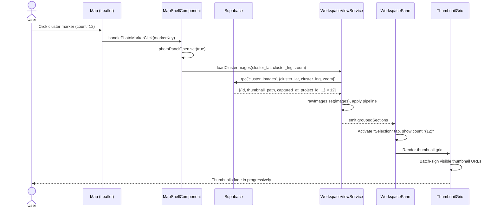
```mermaid
sequenceDiagram
    actor User
    participant Map as Map (Leaflet)
    participant MS as MapShellComponent
    participant Supa as Supabase
    participant WVS as WorkspaceViewService
    participant WP as WorkspacePane
    participant Grid as ThumbnailGrid

    User->>Map: Click cluster marker (count=12)
    Map->>MS: handlePhotoMarkerClick(markerKey)
    MS->>MS: photoPanelOpen.set(true)
    MS->>WVS: loadClusterImages(cluster_lat, cluster_lng, zoom)
    WVS->>Supa: rpc('cluster_images', {cluster_lat, cluster_lng, zoom})
    Supa-->>WVS: [{id, thumbnail_path, captured_at, project_id, ...} × 12]
    WVS->>WVS: rawImages.set(images), apply pipeline
    WVS-->>WP: emit groupedSections
    WP->>WP: Activate "Selection" tab, show count "(12)"
    WP->>Grid: Render thumbnail grid
    Grid->>Grid: Batch-sign visible thumbnail URLs
    Grid-->>User: Thumbnails fade in progressively
```

**Expected state after:**

- `photoPanelOpen` = true
- `activeTabId` = `'selection'`
- Active Selection tab label shows "(12)"
- Toolbar visible: Grouping, Filter, Sort, Projects
- Thumbnail grid shows 12 images (default sort: Date captured ↓)
- No filters, no grouping, no project scope applied

---

## WV-2: Browse and Scroll Thumbnails

**Product context:** UC2 §6 — clerk reviews thumbnails to assess site condition.

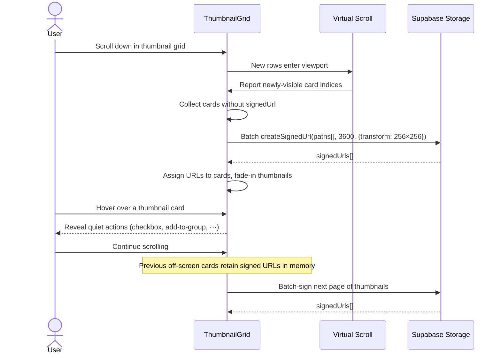
```mermaid
sequenceDiagram
    actor User
    participant Grid as ThumbnailGrid
    participant VScroll as Virtual Scroll
    participant Storage as Supabase Storage

    User->>Grid: Scroll down in thumbnail grid
    Grid->>VScroll: New rows enter viewport
    VScroll->>Grid: Report newly-visible card indices
    Grid->>Grid: Collect cards without signedUrl
    Grid->>Storage: Batch createSignedUrl(paths[], 3600, {transform: 256×256})
    Storage-->>Grid: signedUrls[]
    Grid->>Grid: Assign URLs to cards, fade-in thumbnails

    User->>Grid: Hover over a thumbnail card
    Grid-->>User: Reveal quiet actions (checkbox, add-to-group, ⋯)

    User->>Grid: Continue scrolling
    Note over Grid: Previous off-screen cards retain signed URLs in memory
    Grid->>Storage: Batch-sign next page of thumbnails
    Storage-->>Grid: signedUrls[]
```

**Expected state during:**

- Virtual scroll renders only visible rows (~2–3 columns × visible height)
- Cards show CSS gradient placeholder until thumbnail loads
- Signed URLs are cached in memory — scrolling back up does not re-sign

---

## WV-3: Sort Images by Property

**Product context:** UC2 §6 — clerk wants newest images first, then switches to sort by address for geographic grouping.

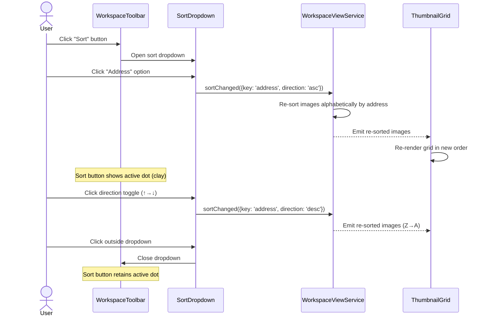
```mermaid
sequenceDiagram
    actor User
    participant Toolbar as WorkspaceToolbar
    participant SortDD as SortDropdown
    participant WVS as WorkspaceViewService
    participant Grid as ThumbnailGrid

    User->>Toolbar: Click "Sort" button
    Toolbar->>SortDD: Open sort dropdown

    User->>SortDD: Click "Address" option
    SortDD->>WVS: sortChanged({key: 'address', direction: 'asc'})
    WVS->>WVS: Re-sort images alphabetically by address
    WVS-->>Grid: Emit re-sorted images
    Grid->>Grid: Re-render grid in new order
    Note over Toolbar: Sort button shows active dot (clay)

    User->>SortDD: Click direction toggle (↑→↓)
    SortDD->>WVS: sortChanged({key: 'address', direction: 'desc'})
    WVS-->>Grid: Emit re-sorted images (Z→A)

    User->>SortDD: Click outside dropdown
    SortDD->>Toolbar: Close dropdown
    Note over Toolbar: Sort button retains active dot
```

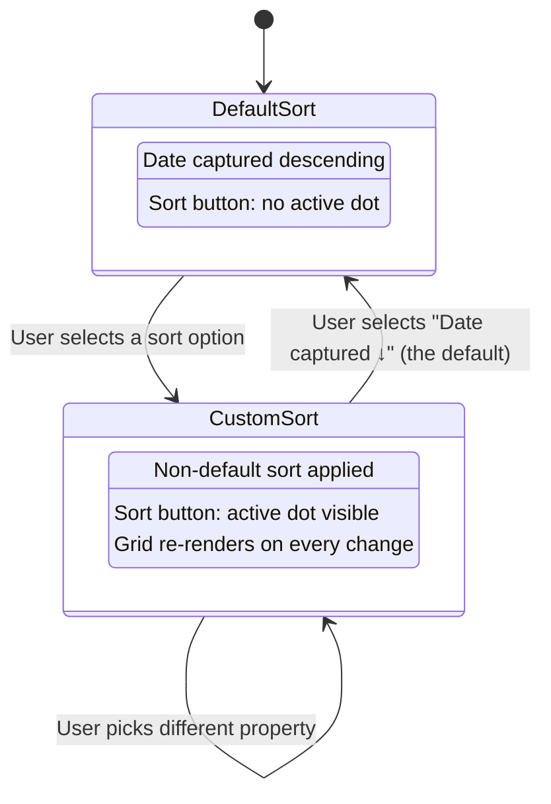
```mermaid
stateDiagram-v2
    [*] --> DefaultSort
    DefaultSort --> CustomSort: User selects a sort option
    CustomSort --> CustomSort: User changes direction (↑/↓)
    CustomSort --> CustomSort: User picks different property
    CustomSort --> DefaultSort: User selects "Date captured ↓" (the default)

    state DefaultSort {
        [*]: Date captured descending
        [*]: Sort button: no active dot
    }
    state CustomSort {
        [*]: Non-default sort applied
        [*]: Sort button: active dot visible
        [*]: Grid re-renders on every change
    }
```

---

## WV-4: Group Images by Property

**Product context:** UC2 §7–9 — clerk groups images by city to compare site conditions across locations.

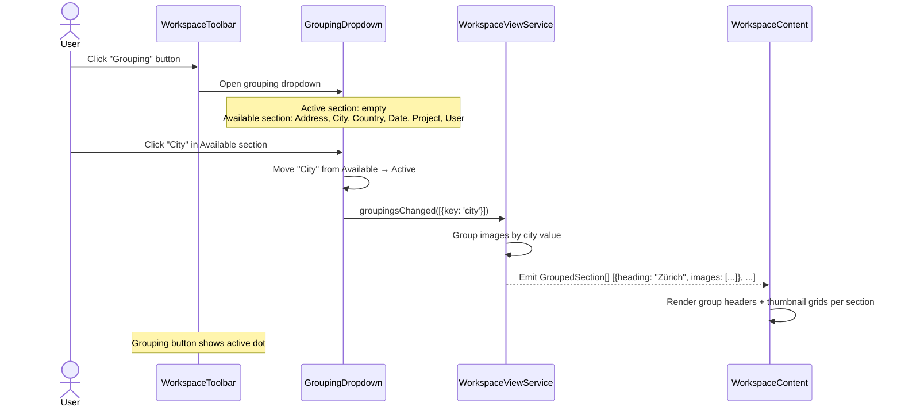
```mermaid
sequenceDiagram
    actor User
    participant Toolbar as WorkspaceToolbar
    participant GroupDD as GroupingDropdown
    participant WVS as WorkspaceViewService
    participant Content as WorkspaceContent

    User->>Toolbar: Click "Grouping" button
    Toolbar->>GroupDD: Open grouping dropdown

    Note over GroupDD: Active section: empty<br/>Available section: Address, City, Country, Date, Project, User

    User->>GroupDD: Click "City" in Available section
    GroupDD->>GroupDD: Move "City" from Available → Active
    GroupDD->>WVS: groupingsChanged([{key: 'city'}])
    WVS->>WVS: Group images by city value
    WVS-->>Content: Emit GroupedSection[] [{heading: "Zürich", images: [...]}, ...]

    Content->>Content: Render group headers + thumbnail grids per section
    Note over Toolbar: Grouping button shows active dot
```

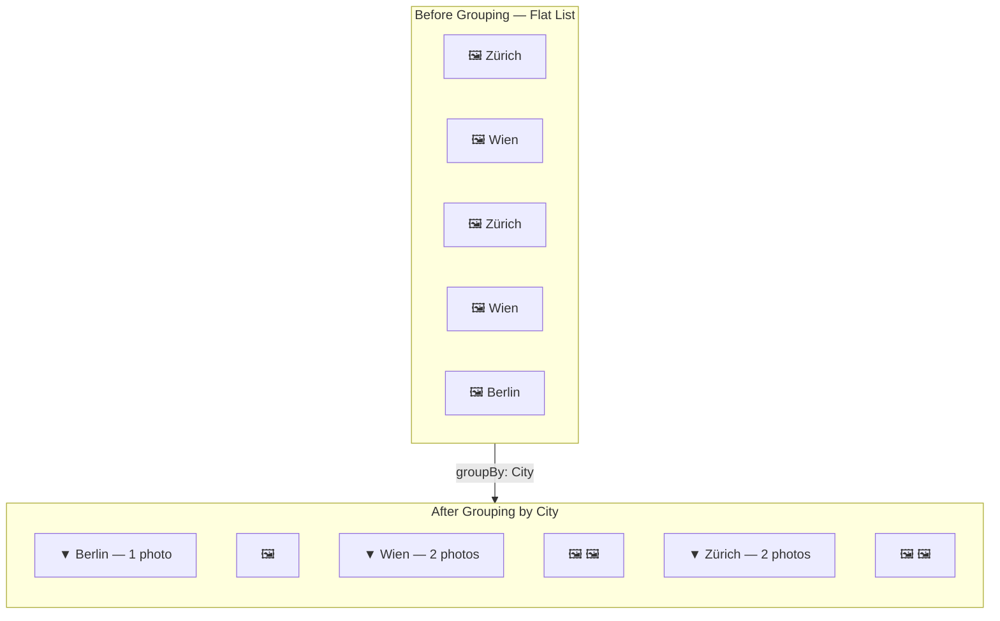
```mermaid
flowchart TD
    subgraph Before["Before Grouping — Flat List"]
        direction LR
        I1["🖼 Zürich"]
        I2["🖼 Wien"]
        I3["🖼 Zürich"]
        I4["🖼 Wien"]
        I5["🖼 Berlin"]
    end

    subgraph After["After Grouping by City"]
        direction TB
        H1["▼ Berlin — 1 photo"]
        G1["🖼"]
        H2["▼ Wien — 2 photos"]
        G2["🖼 🖼"]
        H3["▼ Zürich — 2 photos"]
        G3["🖼 🖼"]
    end

    Before -->|"groupBy: City"| After
```

---

## WV-5: Multi-Level Grouping

**Product context:** UC2 §8 — clerk groups by City then by Project to see which projects have work in each city.

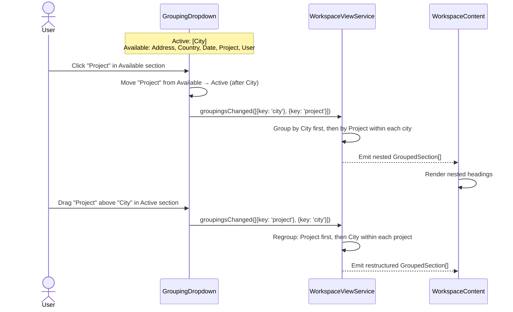
```mermaid
sequenceDiagram
    actor User
    participant GroupDD as GroupingDropdown
    participant WVS as WorkspaceViewService
    participant Content as WorkspaceContent

    Note over GroupDD: Active: [City]<br/>Available: Address, Country, Date, Project, User

    User->>GroupDD: Click "Project" in Available section
    GroupDD->>GroupDD: Move "Project" from Available → Active (after City)
    GroupDD->>WVS: groupingsChanged([{key: 'city'}, {key: 'project'}])

    WVS->>WVS: Group by City first, then by Project within each city
    WVS-->>Content: Emit nested GroupedSection[]

    Content->>Content: Render nested headings

    User->>GroupDD: Drag "Project" above "City" in Active section
    GroupDD->>WVS: groupingsChanged([{key: 'project'}, {key: 'city'}])
    WVS->>WVS: Regroup: Project first, then City within each project
    WVS-->>Content: Emit restructured GroupedSection[]
```

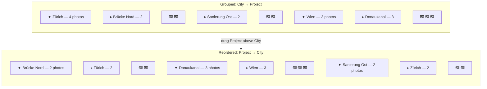
```mermaid
flowchart TD
    subgraph Level1["Grouped: City → Project"]
        direction TB
        H_Z["▼ Zürich — 4 photos"]
        H_ZP1["  ▸ Brücke Nord — 2"]
        G_ZP1["  🖼 🖼"]
        H_ZP2["  ▸ Sanierung Ost — 2"]
        G_ZP2["  🖼 🖼"]
        H_W["▼ Wien — 3 photos"]
        H_WP1["  ▸ Donaukanal — 3"]
        G_WP1["  🖼 🖼 🖼"]
    end

    subgraph Level2["Reordered: Project → City"]
        direction TB
        H_P1["▼ Brücke Nord — 2 photos"]
        H_P1C["  ▸ Zürich — 2"]
        G_P1C["  🖼 🖼"]
        H_P2["▼ Donaukanal — 3 photos"]
        H_P2C["  ▸ Wien — 3"]
        G_P2C["  🖼 🖼 🖼"]
        H_P3["▼ Sanierung Ost — 2 photos"]
        H_P3C["  ▸ Zürich — 2"]
        G_P3C["  🖼 🖼"]
    end

    Level1 -->|"drag Project above City"| Level2
```

---

## WV-6: Filter Images with Rules

**Product context:** UC2 §5 — clerk narrows results with metadata filters (e.g., "Material = Beton").

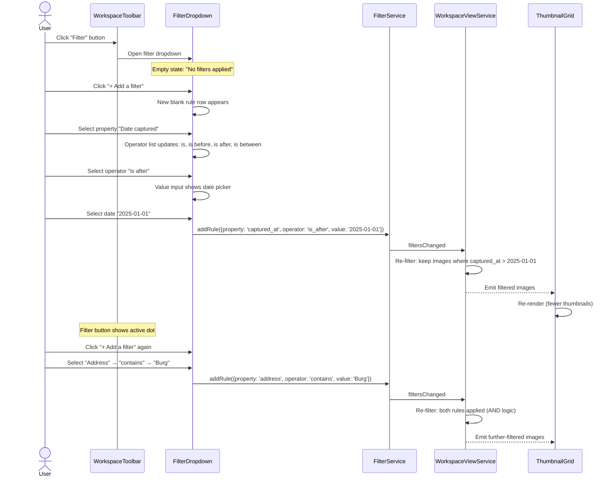
```mermaid
sequenceDiagram
    actor User
    participant Toolbar as WorkspaceToolbar
    participant FilterDD as FilterDropdown
    participant FS as FilterService
    participant WVS as WorkspaceViewService
    participant Grid as ThumbnailGrid

    User->>Toolbar: Click "Filter" button
    Toolbar->>FilterDD: Open filter dropdown
    Note over FilterDD: Empty state: "No filters applied"

    User->>FilterDD: Click "+ Add a filter"
    FilterDD->>FilterDD: New blank rule row appears

    User->>FilterDD: Select property "Date captured"
    FilterDD->>FilterDD: Operator list updates: is, is before, is after, is between

    User->>FilterDD: Select operator "is after"
    FilterDD->>FilterDD: Value input shows date picker

    User->>FilterDD: Select date "2025-01-01"
    FilterDD->>FS: addRule({property: 'captured_at', operator: 'is_after', value: '2025-01-01'})
    FS->>WVS: filtersChanged
    WVS->>WVS: Re-filter: keep images where captured_at > 2025-01-01
    WVS-->>Grid: Emit filtered images
    Grid->>Grid: Re-render (fewer thumbnails)
    Note over Toolbar: Filter button shows active dot

    User->>FilterDD: Click "+ Add a filter" again
    User->>FilterDD: Select "Address" → "contains" → "Burg"
    FilterDD->>FS: addRule({property: 'address', operator: 'contains', value: 'Burg'})
    FS->>WVS: filtersChanged
    WVS->>WVS: Re-filter: both rules applied (AND logic)
    WVS-->>Grid: Emit further-filtered images
```

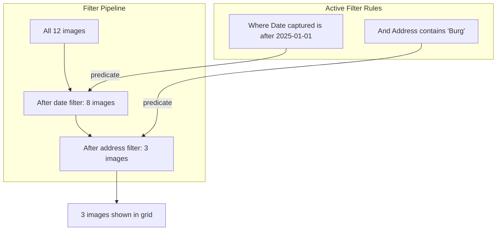
```mermaid
flowchart TD
    subgraph Rules["Active Filter Rules"]
        R1["Where Date captured is after 2025-01-01"]
        R2["And Address contains 'Burg'"]
    end

    subgraph Pipeline["Filter Pipeline"]
        All["All 12 images"]
        F1["After date filter: 8 images"]
        F2["After address filter: 3 images"]
    end

    All --> F1
    R1 -->|"predicate"| F1
    F1 --> F2
    R2 -->|"predicate"| F2

    F2 --> Result["3 images shown in grid"]
```

---

## WV-7: Scope to Projects

**Product context:** UC2 §3 — clerk selects projects relevant to the quote.

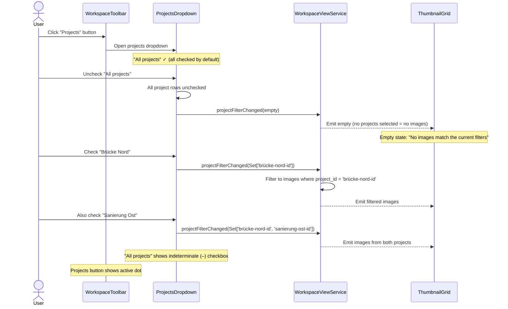
```mermaid
sequenceDiagram
    actor User
    participant Toolbar as WorkspaceToolbar
    participant ProjDD as ProjectsDropdown
    participant WVS as WorkspaceViewService
    participant Grid as ThumbnailGrid

    User->>Toolbar: Click "Projects" button
    Toolbar->>ProjDD: Open projects dropdown
    Note over ProjDD: "All projects" ✓ (all checked by default)

    User->>ProjDD: Uncheck "All projects"
    ProjDD->>ProjDD: All project rows unchecked
    ProjDD->>WVS: projectFilterChanged(empty)
    WVS-->>Grid: Emit empty (no projects selected = no images)
    Note over Grid: Empty state: "No images match the current filters"

    User->>ProjDD: Check "Brücke Nord"
    ProjDD->>WVS: projectFilterChanged(Set['brücke-nord-id'])
    WVS->>WVS: Filter to images where project_id = 'brücke-nord-id'
    WVS-->>Grid: Emit filtered images

    User->>ProjDD: Also check "Sanierung Ost"
    ProjDD->>WVS: projectFilterChanged(Set['brücke-nord-id', 'sanierung-ost-id'])
    WVS-->>Grid: Emit images from both projects
    Note over ProjDD: "All projects" shows indeterminate (–) checkbox
    Note over Toolbar: Projects button shows active dot
```

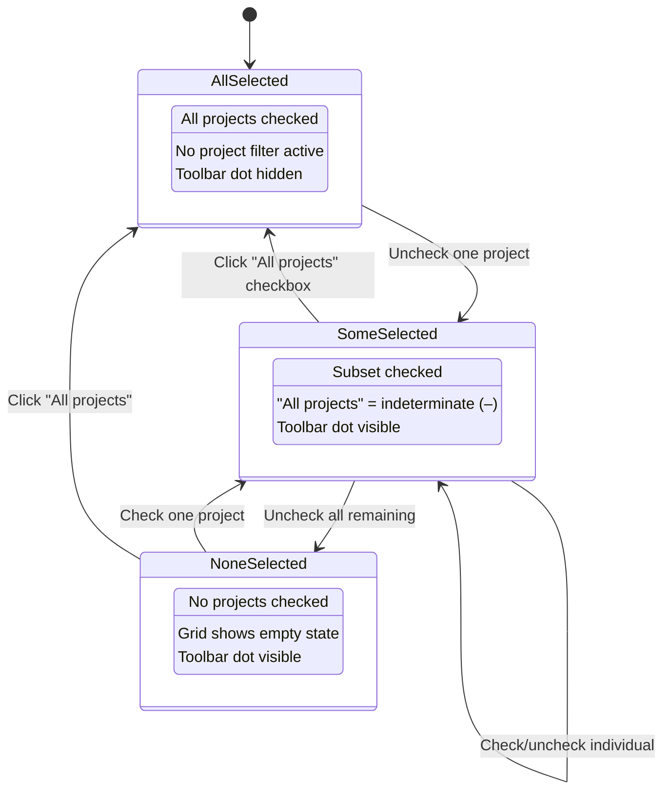
```mermaid
stateDiagram-v2
    [*] --> AllSelected

    state AllSelected {
        [*]: All projects checked
        [*]: No project filter active
        [*]: Toolbar dot hidden
    }

    state SomeSelected {
        [*]: Subset checked
        [*]: "All projects" = indeterminate (–)
        [*]: Toolbar dot visible
    }

    state NoneSelected {
        [*]: No projects checked
        [*]: Grid shows empty state
        [*]: Toolbar dot visible
    }

    AllSelected --> SomeSelected: Uncheck one project
    SomeSelected --> AllSelected: Click "All projects" checkbox
    SomeSelected --> SomeSelected: Check/uncheck individual
    SomeSelected --> NoneSelected: Uncheck all remaining
    NoneSelected --> SomeSelected: Check one project
    NoneSelected --> AllSelected: Click "All projects"
```

---

## WV-8: Combined Filter + Sort + Group

**Product context:** UC2 §5–9 — clerk applies all controls together for a comprehensive workspace view.

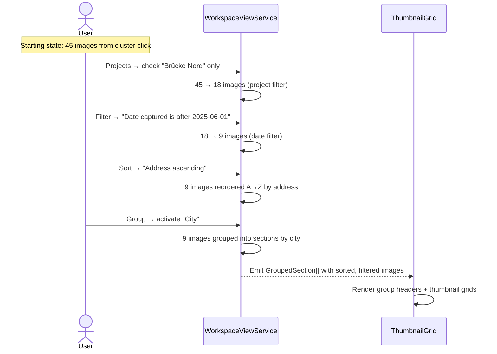
```mermaid
sequenceDiagram
    actor User
    participant WVS as WorkspaceViewService
    participant Grid as ThumbnailGrid

    Note over User: Starting state: 45 images from cluster click

    User->>WVS: Projects → check "Brücke Nord" only
    WVS->>WVS: 45 → 18 images (project filter)

    User->>WVS: Filter → "Date captured is after 2025-06-01"
    WVS->>WVS: 18 → 9 images (date filter)

    User->>WVS: Sort → "Address ascending"
    WVS->>WVS: 9 images reordered A→Z by address

    User->>WVS: Group → activate "City"
    WVS->>WVS: 9 images grouped into sections by city

    WVS-->>Grid: Emit GroupedSection[] with sorted, filtered images
    Grid->>Grid: Render group headers + thumbnail grids
```

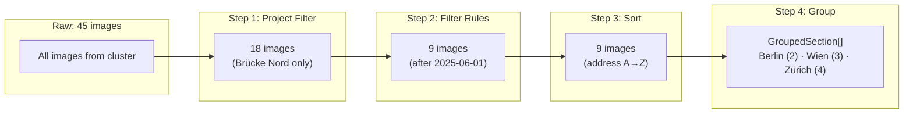
```mermaid
flowchart LR
    subgraph Input["Raw: 45 images"]
        direction TB
        A["All images from cluster"]
    end

    subgraph P1["Step 1: Project Filter"]
        B["18 images\n(Brücke Nord only)"]
    end

    subgraph P2["Step 2: Filter Rules"]
        C["9 images\n(after 2025-06-01)"]
    end

    subgraph P3["Step 3: Sort"]
        D["9 images\n(address A→Z)"]
    end

    subgraph P4["Step 4: Group"]
        E["GroupedSection[]\nBerlin (2) · Wien (3) · Zürich (4)"]
    end

    A --> B --> C --> D --> E
```

---

## WV-9: Open Image Detail from Thumbnail

**Product context:** UC1 §6 — technician taps thumbnail to see full image. UC2 §9 — clerk inspects detail.

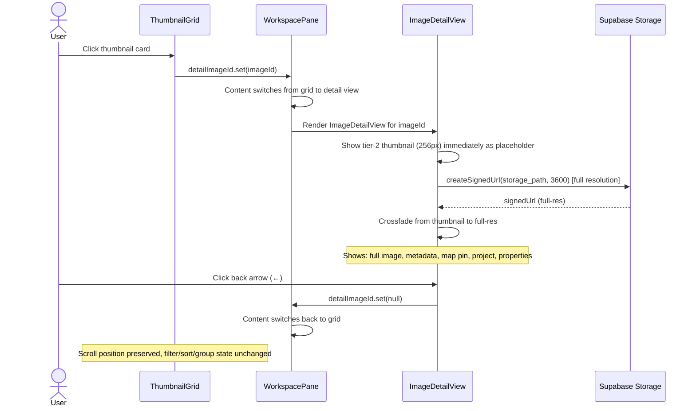
```mermaid
sequenceDiagram
    actor User
    participant Grid as ThumbnailGrid
    participant WP as WorkspacePane
    participant Detail as ImageDetailView
    participant Storage as Supabase Storage

    User->>Grid: Click thumbnail card
    Grid->>WP: detailImageId.set(imageId)
    WP->>WP: Content switches from grid to detail view
    WP->>Detail: Render ImageDetailView for imageId

    Detail->>Detail: Show tier-2 thumbnail (256px) immediately as placeholder
    Detail->>Storage: createSignedUrl(storage_path, 3600) [full resolution]
    Storage-->>Detail: signedUrl (full-res)
    Detail->>Detail: Crossfade from thumbnail to full-res

    Note over Detail: Shows: full image, metadata, map pin, project, properties

    User->>Detail: Click back arrow (←)
    Detail->>WP: detailImageId.set(null)
    WP->>WP: Content switches back to grid
    Note over Grid: Scroll position preserved, filter/sort/group state unchanged
```

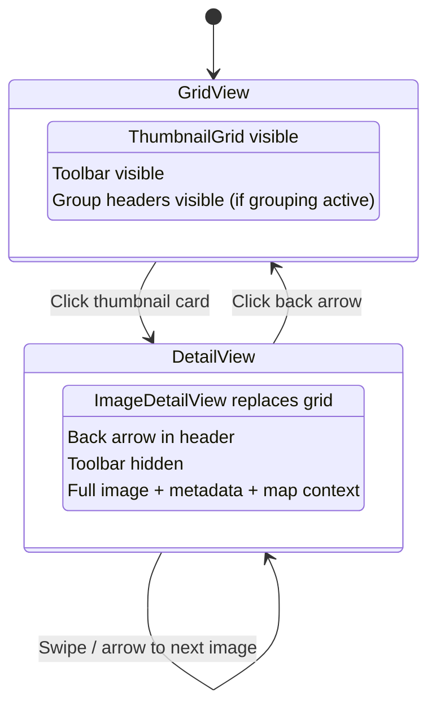
```mermaid
stateDiagram-v2
    [*] --> GridView

    state GridView {
        [*]: ThumbnailGrid visible
        [*]: Toolbar visible
        [*]: Group headers visible (if grouping active)
    }

    state DetailView {
        [*]: ImageDetailView replaces grid
        [*]: Back arrow in header
        [*]: Toolbar hidden
        [*]: Full image + metadata + map context
    }

    GridView --> DetailView: Click thumbnail card
    DetailView --> GridView: Click back arrow
    DetailView --> DetailView: Swipe / arrow to next image
```

---

## WV-10: Save Active Selection to Named Group

**Product context:** UC1 §7 — technician saves interesting images. UC2 §7 — clerk creates group for quote.

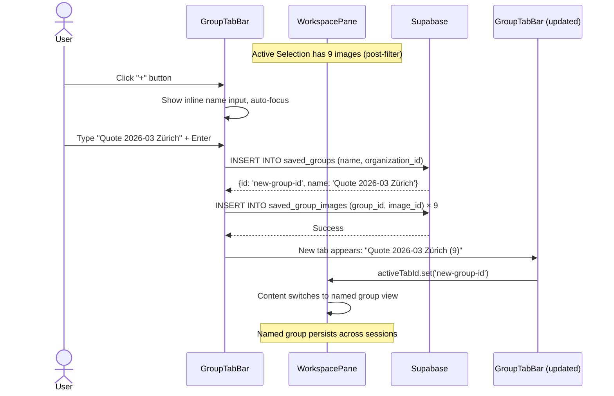
```mermaid
sequenceDiagram
    actor User
    participant TabBar as GroupTabBar
    participant WP as WorkspacePane
    participant Supa as Supabase
    participant TabBar2 as GroupTabBar (updated)

    Note over WP: Active Selection has 9 images (post-filter)

    User->>TabBar: Click "+" button
    TabBar->>TabBar: Show inline name input, auto-focus

    User->>TabBar: Type "Quote 2026-03 Zürich" + Enter
    TabBar->>Supa: INSERT INTO saved_groups (name, organization_id)
    Supa-->>TabBar: {id: 'new-group-id', name: 'Quote 2026-03 Zürich'}

    TabBar->>Supa: INSERT INTO saved_group_images (group_id, image_id) × 9
    Supa-->>TabBar: Success

    TabBar->>TabBar2: New tab appears: "Quote 2026-03 Zürich (9)"
    TabBar2->>WP: activeTabId.set('new-group-id')
    WP->>WP: Content switches to named group view
    Note over WP: Named group persists across sessions
```

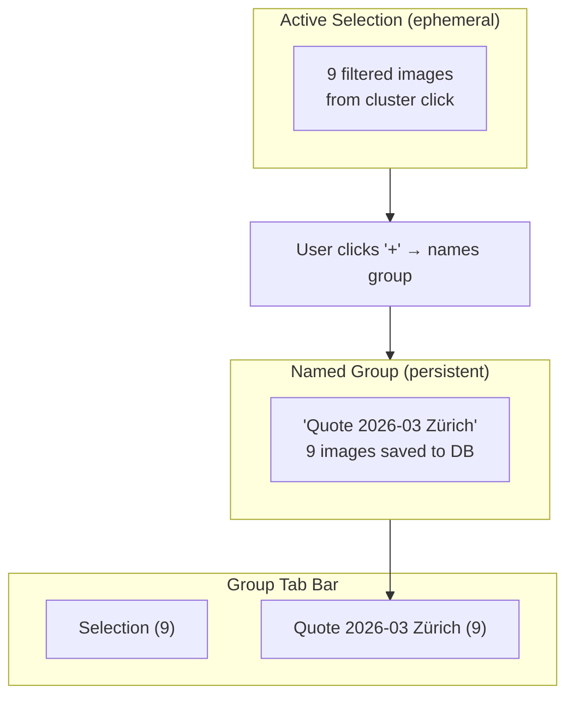
```mermaid
flowchart TD
    subgraph ActiveSelection["Active Selection (ephemeral)"]
        AS["9 filtered images\nfrom cluster click"]
    end

    User["User clicks '+' → names group"]

    subgraph NamedGroup["Named Group (persistent)"]
        NG["'Quote 2026-03 Zürich'\n9 images saved to DB"]
    end

    ActiveSelection --> User --> NamedGroup

    subgraph TabBar["Group Tab Bar"]
        T1["Selection (9)"]
        T2["Quote 2026-03 Zürich (9)"]
    end

    NamedGroup --> T2
```

---

## WV-11: Switch Between Group Tabs

**Product context:** UC2 §8–9 — clerk switches between Active Selection and saved groups.

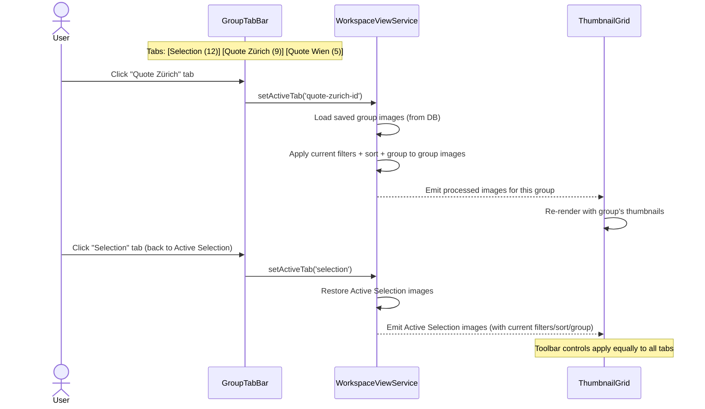
```mermaid
sequenceDiagram
    actor User
    participant TabBar as GroupTabBar
    participant WVS as WorkspaceViewService
    participant Grid as ThumbnailGrid

    Note over TabBar: Tabs: [Selection (12)] [Quote Zürich (9)] [Quote Wien (5)]

    User->>TabBar: Click "Quote Zürich" tab
    TabBar->>WVS: setActiveTab('quote-zurich-id')
    WVS->>WVS: Load saved group images (from DB)
    WVS->>WVS: Apply current filters + sort + group to group images
    WVS-->>Grid: Emit processed images for this group
    Grid->>Grid: Re-render with group's thumbnails

    User->>TabBar: Click "Selection" tab (back to Active Selection)
    TabBar->>WVS: setActiveTab('selection')
    WVS->>WVS: Restore Active Selection images
    WVS-->>Grid: Emit Active Selection images (with current filters/sort/group)
    Note over Grid: Toolbar controls apply equally to all tabs
```

---

## WV-12: Clear All Filters and Grouping

**Product context:** User wants to reset the workspace view to its default state.

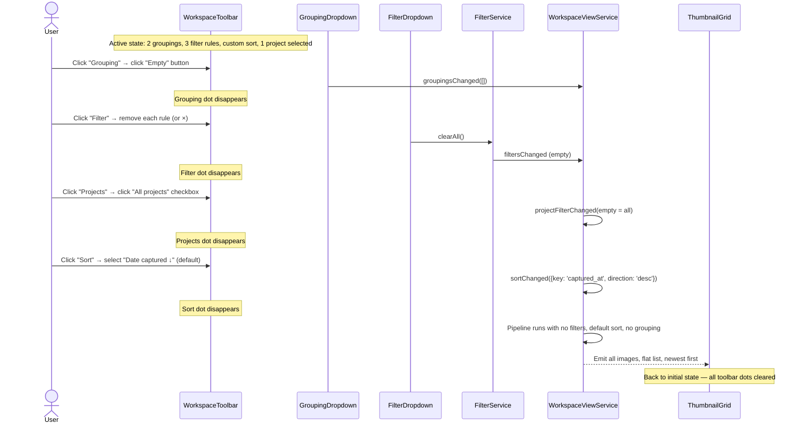
```mermaid
sequenceDiagram
    actor User
    participant Toolbar as WorkspaceToolbar
    participant GroupDD as GroupingDropdown
    participant FilterDD as FilterDropdown
    participant FS as FilterService
    participant WVS as WorkspaceViewService
    participant Grid as ThumbnailGrid

    Note over Toolbar: Active state: 2 groupings, 3 filter rules, custom sort, 1 project selected

    User->>Toolbar: Click "Grouping" → click "Empty" button
    GroupDD->>WVS: groupingsChanged([])
    Note over Toolbar: Grouping dot disappears

    User->>Toolbar: Click "Filter" → remove each rule (or ×)
    FilterDD->>FS: clearAll()
    FS->>WVS: filtersChanged (empty)
    Note over Toolbar: Filter dot disappears

    User->>Toolbar: Click "Projects" → click "All projects" checkbox
    WVS->>WVS: projectFilterChanged(empty = all)
    Note over Toolbar: Projects dot disappears

    User->>Toolbar: Click "Sort" → select "Date captured ↓" (default)
    WVS->>WVS: sortChanged({key: 'captured_at', direction: 'desc'})
    Note over Toolbar: Sort dot disappears

    WVS->>WVS: Pipeline runs with no filters, default sort, no grouping
    WVS-->>Grid: Emit all images, flat list, newest first
    Note over Grid: Back to initial state — all toolbar dots cleared
```

```mermaid
flowchart LR
    subgraph Filtered["Filtered State"]
        A["3 images\ngrouped by City\nsorted by Address\nproject: Brücke Nord\n3 filter rules"]
    end

    subgraph Reset["Reset State"]
        B["All 12 images\nflat list\nsorted by Date ↓\nall projects\nno filters"]
    end

    Filtered -->|"Clear grouping\nClear filters\nAll projects\nDefault sort"| Reset
```

---

## End-to-End Flow: Explore → Curate → Persist

This diagram shows the complete lifecycle of the Active Selection view across all scenarios.

```mermaid
flowchart TD
    subgraph Explore["1. Explore"]
        MarkerClick["Click cluster marker\non map"]
        RadiusSelect["Radius selection\n(long-press drag)"]
    end

    subgraph Populate["2. Populate Active Selection"]
        ClusterRPC["cluster_images RPC"]
        RadiusRPC["Viewport query\n(bounded radius)"]
        SetImages["WorkspaceViewService\n.loadClusterImages()"]
    end

    subgraph Curate["3. Curate (Workspace View)"]
        direction TB
        ProjectScope["Scope to projects"]
        Filter["Apply filter rules"]
        Sort["Sort by property"]
        Group["Group by property"]
        Browse["Browse thumbnails"]
        Detail["Inspect image detail"]
    end

    subgraph Persist["4. Persist"]
        SaveGroup["Save as named group"]
        SwitchTab["Switch to group tab\nfor later reference"]
    end

    MarkerClick --> ClusterRPC --> SetImages
    RadiusSelect --> RadiusRPC --> SetImages
    SetImages --> ProjectScope --> Filter --> Sort --> Group --> Browse
    Browse --> Detail
    Detail -->|"back"| Browse
    Browse --> SaveGroup --> SwitchTab
    SwitchTab -->|"switch back"| Browse

    style Explore fill:#e3f2fd
    style Curate fill:#fff3e0
    style Persist fill:#e8f5e9
```
